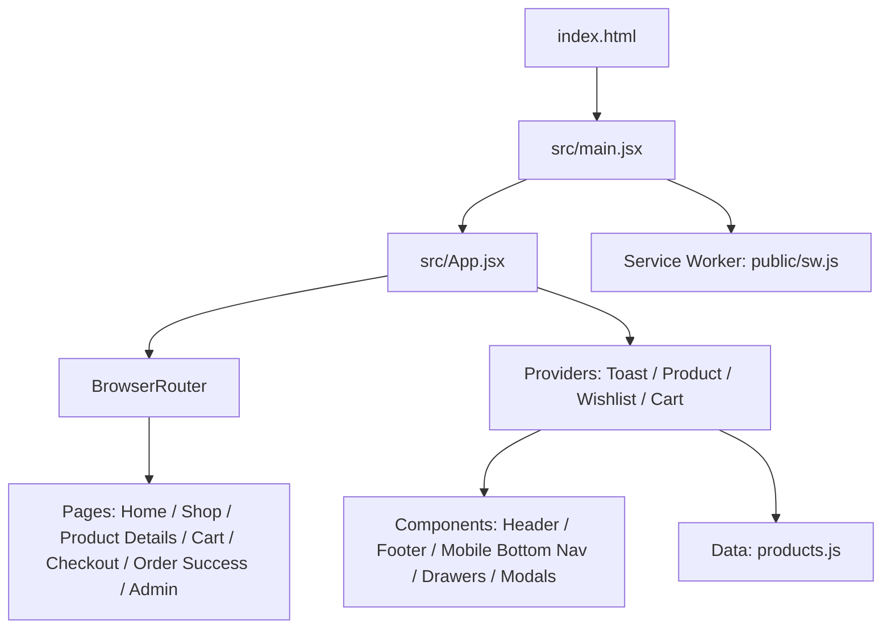
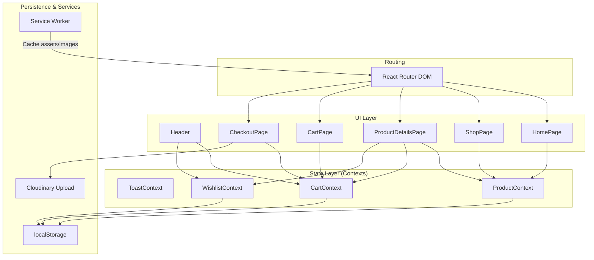
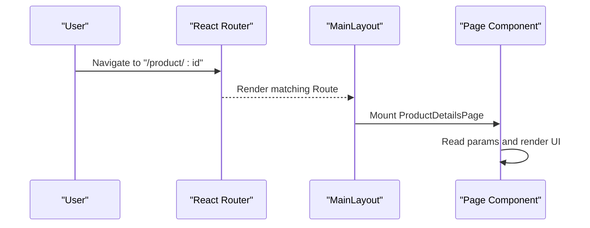
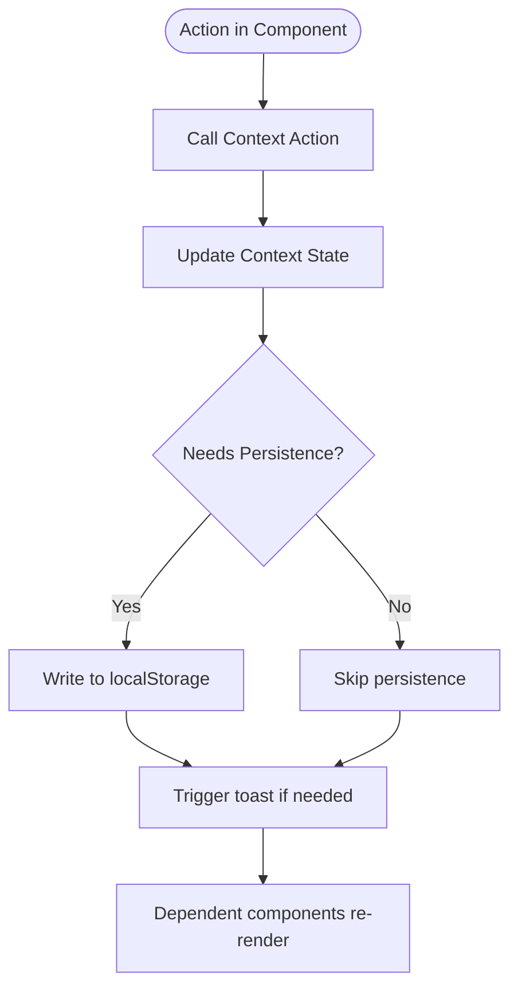
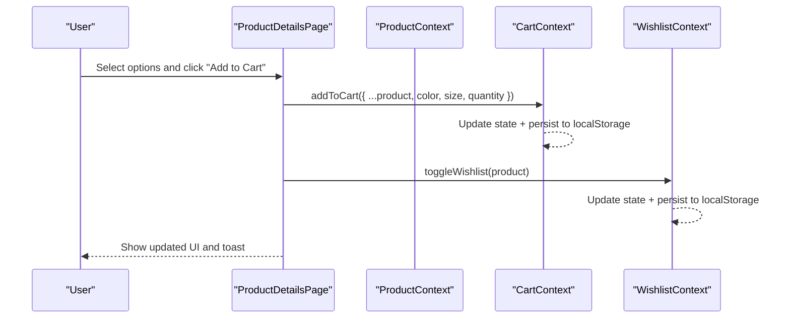
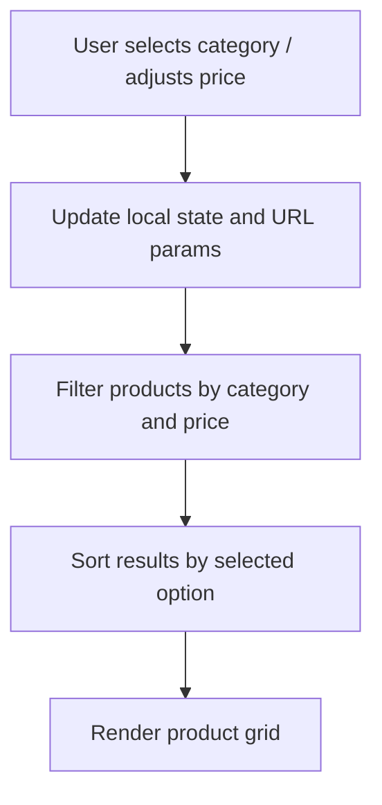
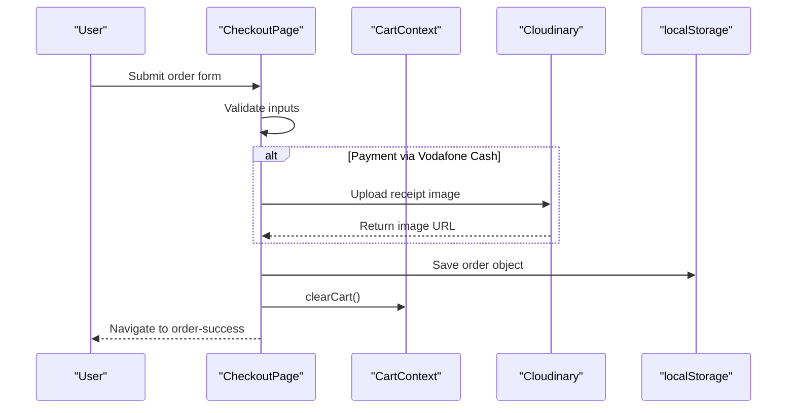
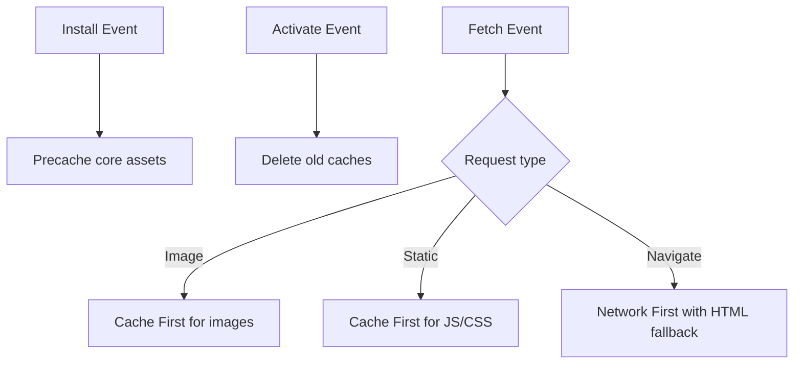
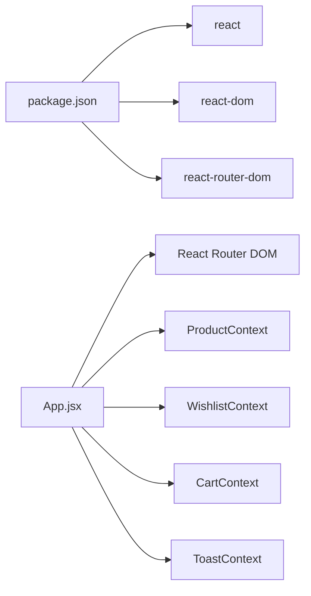

# Architecture Overview

<cite>
**Referenced Files in This Document**
- [main.jsx](file://src/main.jsx)
- [App.jsx](file://src/App.jsx)
- [package.json](file://package.json)
- [vite.config.js](file://vite.config.js)
- [index.html](file://index.html)
- [sw.js](file://public/sw.js)
- [CartContext.jsx](file://src/context/CartContext.jsx)
- [ProductContext.jsx](file://src/context/ProductContext.jsx)
- [WishlistContext.jsx](file://src/context/WishlistContext.jsx)
- [ToastContext.jsx](file://src/context/ToastContext.jsx)
- [HomePage.jsx](file://src/pages/HomePage.jsx)
- [ShopPage.jsx](file://src/pages/ShopPage.jsx)
- [ProductDetailsPage.jsx](file://src/pages/ProductDetailsPage.jsx)
- [CartPage.jsx](file://src/pages/CartPage.jsx)
- [CheckoutPage.jsx](file://src/pages/CheckoutPage.jsx)
- [Header.jsx](file://src/components/Header.jsx)
- [products.js](file://src/data/products.js)
</cite>

## Table of Contents
1. Introduction
2. Project Structure
3. Core Components
4. Architecture Overview
5. Detailed Component Analysis
6. Dependency Analysis
7. Performance Considerations
8. Troubleshooting Guide
9. Conclusion

## Introduction
This document describes the Hadiya Abaya Store React application architecture. It explains how component-based design, Context API for global state, and React Router DOM enable a clean separation of concerns across pages, components, contexts, and utilities. It also documents unidirectional data flow, routing structure, Progressive Web App capabilities via a service worker, and cross-cutting concerns such as localStorage persistence, performance optimization, and responsive design patterns.

## Project Structure
The application is built with Vite and React 18, using React Router DOM for client-side routing. The root entry renders the app inside StrictMode and registers the service worker in production. The app wraps all routes with providers for toasts, products, wishlist, and cart. Pages implement feature-specific logic and consume shared contexts. Static assets and styles are organized under dedicated directories.

**Diagram sources**
- [index.html:1-19](file://index.html#L1-L19)
- [main.jsx:1-21](file://src/main.jsx#L1-L21)
- [App.jsx:1-110](file://src/App.jsx#L1-L110)
- [sw.js:1-98](file://public/sw.js#L1-L98)

**Section sources**
- [index.html:1-19](file://index.html#L1-L19)
- [main.jsx:1-21](file://src/main.jsx#L1-L21)
- [App.jsx:1-110](file://src/App.jsx#L1-L110)
- [package.json:1-21](file://package.json#L1-L21)
- [vite.config.js:1-12](file://vite.config.js#L1-L12)

## Core Components
- Providers (global state):
  - ToastContext: centralized user feedback with auto-dismiss timing.
  - ProductContext: product catalog state with CRUD operations and localStorage persistence.
  - WishlistContext: user’s saved items with toggle/remove and localStorage persistence.
  - CartContext: shopping cart with add/remove/update/clear, totals, and localStorage persistence.
- Shared UI:
  - Header: navigation, search trigger, mobile menu toggle, and badges for cart/wishlist counts.
  - Layout helpers: scroll-to-top behavior and admin route exclusion of common chrome.
- Pages:
  - HomePage: hero slider, categories, featured products.
  - ShopPage: category filters, price range, sorting, and product grid.
  - ProductDetailsPage: gallery, color/size selection, quantity, add-to-cart, wishlist toggle.
  - CartPage: item list, quantity controls, totals, checkout navigation.
  - CheckoutPage: customer info, payment method selection, receipt upload to Cloudinary, order submission, and order success navigation.

Unidirectional data flow pattern:
- User actions in components call context functions (e.g., addToCart).
- Context updates its state and persists to localStorage when applicable.
- Dependent components re-render with new state from the same context.

**Section sources**
- [CartContext.jsx:1-132](file://src/context/CartContext.jsx#L1-L132)
- [ProductContext.jsx:1-56](file://src/context/ProductContext.jsx#L1-L56)
- [WishlistContext.jsx:1-68](file://src/context/WishlistContext.jsx#L1-L68)
- [ToastContext.jsx:1-26](file://src/context/ToastContext.jsx#L1-L26)
- [Header.jsx:1-101](file://src/components/Header.jsx#L1-L101)
- [App.jsx:28-93](file://src/App.jsx#L28-L93)

## Architecture Overview
The system follows a provider-driven architecture where contexts own domain state and expose actions. Pages and components consume state via hooks and dispatch mutations through provided functions. Routing is declarative with React Router, enabling deep links and browser history. The service worker intercepts network requests to cache static assets and images, improving offline resilience and load performance.

**Diagram sources**
- [App.jsx:95-109](file://src/App.jsx#L95-L109)
- [CartContext.jsx:1-132](file://src/context/CartContext.jsx#L1-L132)
- [ProductContext.jsx:1-56](file://src/context/ProductContext.jsx#L1-L56)
- [WishlistContext.jsx:1-68](file://src/context/WishlistContext.jsx#L1-L68)
- [ToastContext.jsx:1-26](file://src/context/ToastContext.jsx#L1-L26)
- [sw.js:1-98](file://public/sw.js#L1-L98)

## Detailed Component Analysis

### Routing and Layout
- Routes define top-level pages for home, shop, product details, cart, checkout, order success, and admin.
- MainLayout conditionally hides header/footer/mobile nav on the admin route and manages global UI toggles (search modal, mobile menu).
- Scroll-to-top behavior resets position on route changes.

**Diagram sources**
- [App.jsx:66-74](file://src/App.jsx#L66-L74)
- [App.jsx:28-93](file://src/App.jsx#L28-L93)

**Section sources**
- [App.jsx:28-93](file://src/App.jsx#L28-L93)
- [App.jsx:95-109](file://src/App.jsx#L95-L109)

### Global State Management (Contexts)
- ProductContext:
  - Initializes from localStorage or default dataset; persists on change.
  - Provides add/update/delete product operations used by admin flows.
- CartContext:
  - Manages cart items with variant keys (id, color, size), quantities, and totals.
  - Persists cart to localStorage and exposes open/close drawer controls.
- WishlistContext:
  - Tracks wishlisted items with toggle/remove and persistence.
- ToastContext:
  - Centralized notifications with automatic dismissal.

**Diagram sources**
- [CartContext.jsx:42-109](file://src/context/CartContext.jsx#L42-L109)
- [ProductContext.jsx:20-39](file://src/context/ProductContext.jsx#L20-L39)
- [WishlistContext.jsx:22-48](file://src/context/WishlistContext.jsx#L22-L48)
- [ToastContext.jsx:5-23](file://src/context/ToastContext.jsx#L5-L23)

**Section sources**
- [CartContext.jsx:1-132](file://src/context/CartContext.jsx#L1-L132)
- [ProductContext.jsx:1-56](file://src/context/ProductContext.jsx#L1-L56)
- [WishlistContext.jsx:1-68](file://src/context/WishlistContext.jsx#L1-L68)
- [ToastContext.jsx:1-26](file://src/context/ToastContext.jsx#L1-L26)

### Pages and Data Flow

#### Product Details Page
- Reads product from ProductContext by id parameter.
- Allows selecting color, size, and quantity.
- Adds to cart via CartContext and toggles wishlist via WishlistContext.

**Diagram sources**
- [ProductDetailsPage.jsx:1-176](file://src/pages/ProductDetailsPage.jsx#L1-L176)
- [CartContext.jsx:42-74](file://src/context/CartContext.jsx#L42-L74)
- [WishlistContext.jsx:22-39](file://src/context/WishlistContext.jsx#L22-L39)

**Section sources**
- [ProductDetailsPage.jsx:1-176](file://src/pages/ProductDetailsPage.jsx#L1-L176)

#### Shop Page Filtering and Sorting
- Uses URL query parameters to reflect selected category.
- Filters by category and max price; sorts by featured or price.
- Renders product cards that navigate to details.

**Diagram sources**
- [ShopPage.jsx:6-45](file://src/pages/ShopPage.jsx#L6-L45)

**Section sources**
- [ShopPage.jsx:1-195](file://src/pages/ShopPage.jsx#L1-L195)

#### Checkout Flow
- Validates form fields and payment method requirements.
- Uploads receipt image to Cloudinary when paying via Vodafone Cash.
- Saves order to localStorage and navigates to order success page.

**Diagram sources**
- [CheckoutPage.jsx:90-133](file://src/pages/CheckoutPage.jsx#L90-L133)
- [CartContext.jsx:99-101](file://src/context/CartContext.jsx#L99-L101)

**Section sources**
- [CheckoutPage.jsx:1-489](file://src/pages/CheckoutPage.jsx#L1-L489)

### Service Worker and Offline Strategy
- Precaches essential assets on install.
- Cleans up old caches on activate.
- Implements caching strategies:
  - Images: Cache First with network fallback.
  - Static assets (JS/CSS): Cache First.
  - Navigation requests: Network First with HTML fallback.

**Diagram sources**
- [sw.js:15-98](file://public/sw.js#L15-L98)

**Section sources**
- [sw.js:1-98](file://public/sw.js#L1-L98)
- [main.jsx:11-20](file://src/main.jsx#L11-L20)

## Dependency Analysis
- Runtime dependencies include React, ReactDOM, and React Router DOM.
- Build tooling uses Vite with the React plugin.
- Application modules depend on contexts for shared state and on pages for routing.

**Diagram sources**
- [package.json:11-15](file://package.json#L11-L15)
- [App.jsx:95-109](file://src/App.jsx#L95-L109)

**Section sources**
- [package.json:1-21](file://package.json#L1-L21)
- [vite.config.js:1-12](file://vite.config.js#L1-L12)

## Performance Considerations
- LocalStorage persistence reduces server round-trips for cart, wishlist, and products, improving perceived responsiveness.
- Service worker caching strategies minimize network latency for images and static assets, supporting offline access.
- Conditional rendering of layout chrome on admin routes reduces unnecessary DOM work.
- Passive scroll listeners avoid main thread jank during scroll events.
- Lazy loading attributes on images improve initial paint time.

[No sources needed since this section provides general guidance]

## Troubleshooting Guide
- Service Worker registration:
  - Ensure registration runs only in production and handles errors gracefully.
  - Verify that the SW scope and precached assets match deployment paths.
- Context state mismatches:
  - If UI does not reflect expected state, check localStorage keys and JSON parsing for cart, wishlist, and products.
  - Confirm that actions update state immutably and trigger re-renders.
- Checkout validation:
  - Validate required fields before submission.
  - For Vodafone Cash, ensure receipt upload completes successfully before allowing submission.

**Section sources**
- [main.jsx:11-20](file://src/main.jsx#L11-L20)
- [CartContext.jsx:7-40](file://src/context/CartContext.jsx#L7-L40)
- [ProductContext.jsx:7-18](file://src/context/ProductContext.jsx#L7-L18)
- [WishlistContext.jsx:7-20](file://src/context/WishlistContext.jsx#L7-L20)
- [CheckoutPage.jsx:90-133](file://src/pages/CheckoutPage.jsx#L90-L133)

## Conclusion
The Hadiya Abaya Store employs a clear, scalable architecture:
- Component-based UI with focused responsibilities.
- Context API for centralized, persistent global state with unidirectional data flow.
- Declarative routing for seamless navigation across key store pages.
- Service worker integration for robust offline support and performance gains.
This design supports maintainability, extensibility, and a smooth user experience across devices and network conditions.