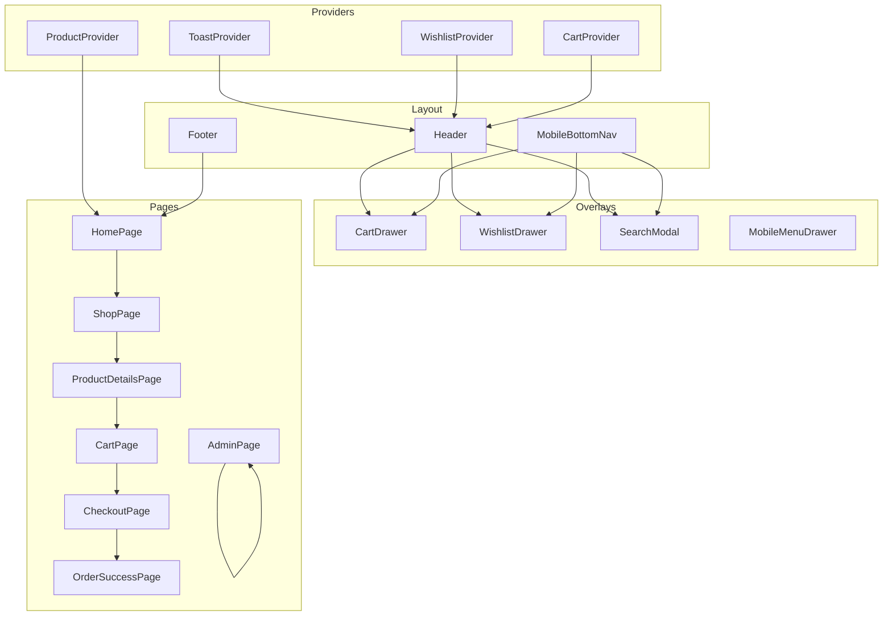
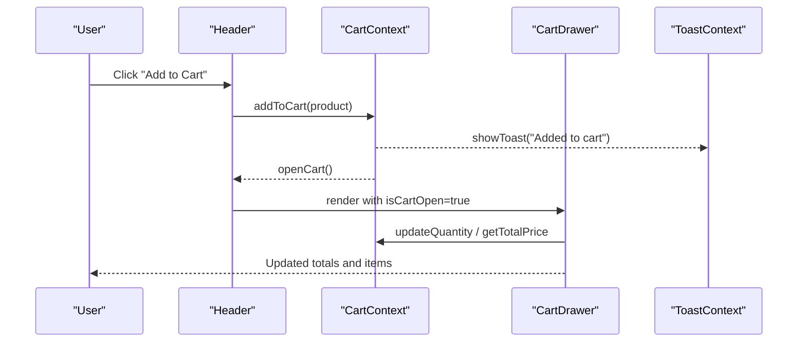
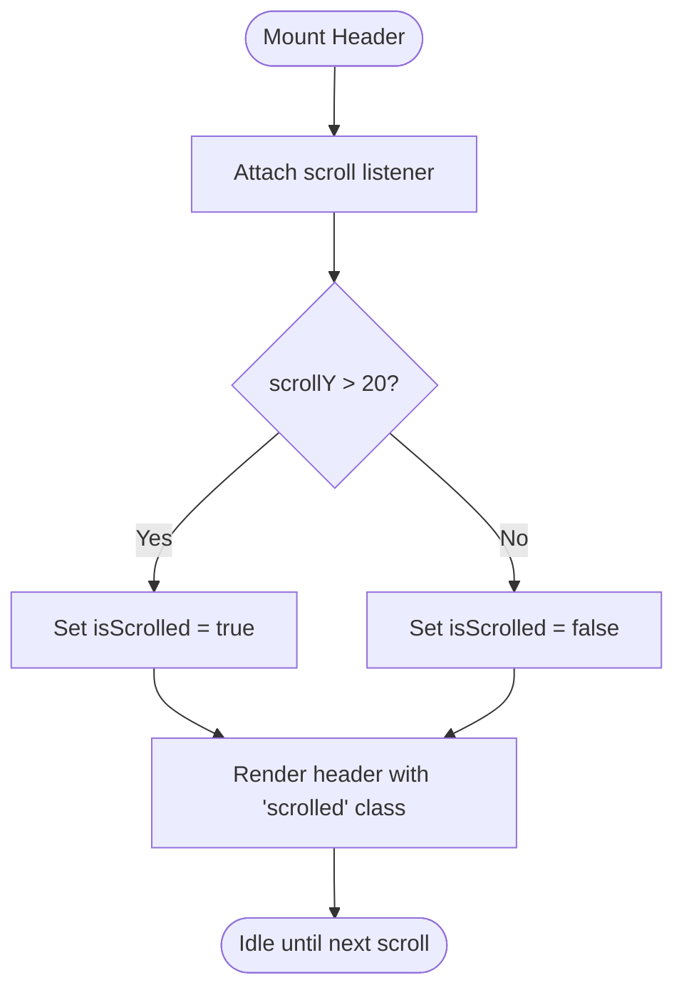
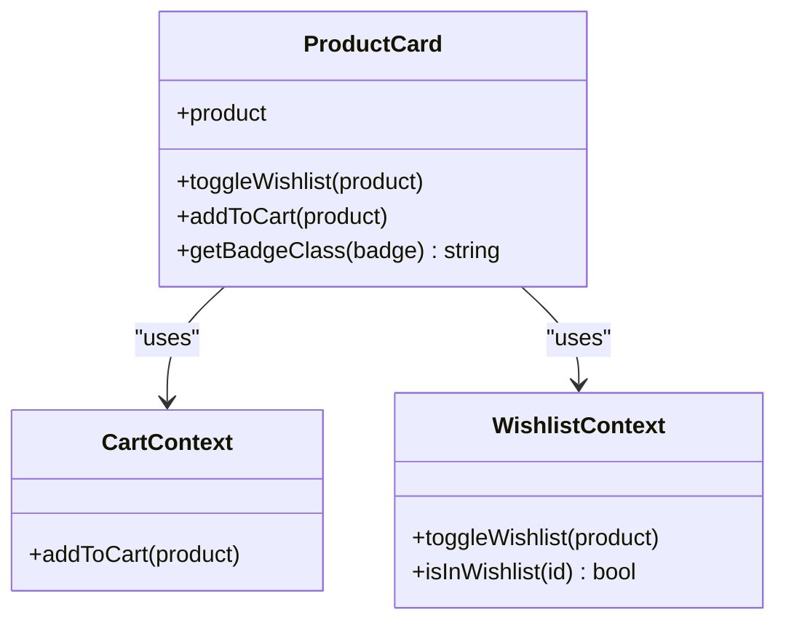
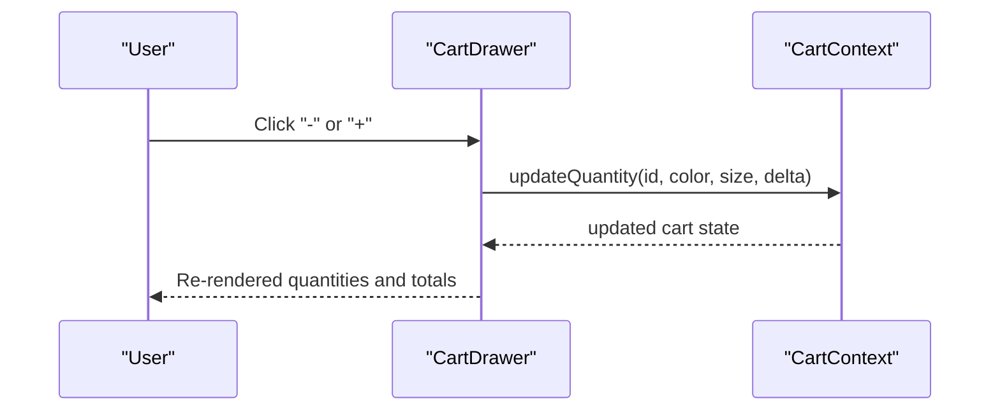
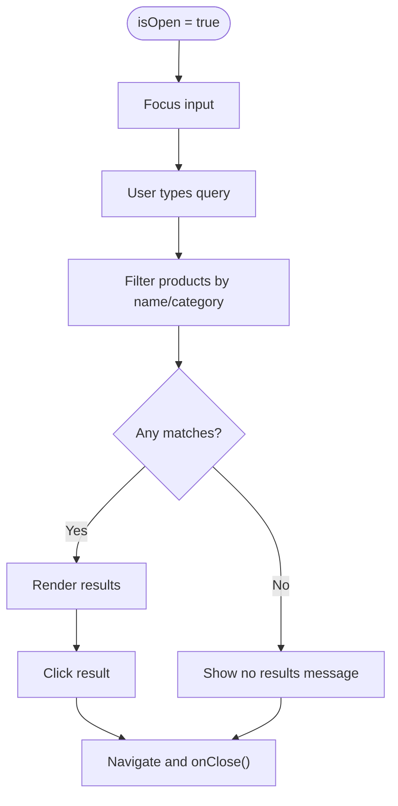
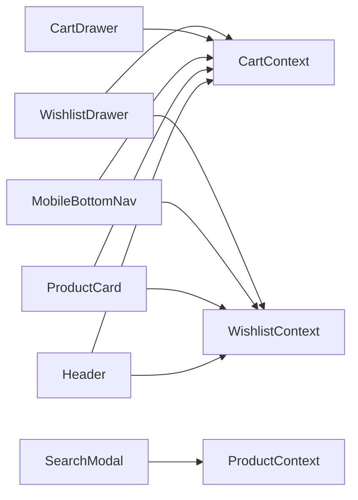

# Component Library

<cite>
**Referenced Files in This Document**
- [App.jsx](file://src/App.jsx)
- [Header.jsx](file://src/components/Header.jsx)
- [ProductCard.jsx](file://src/components/ProductCard.jsx)
- [CartDrawer.jsx](file://src/components/CartDrawer.jsx)
- [WishlistDrawer.jsx](file://src/components/WishlistDrawer.jsx)
- [SearchModal.jsx](file://src/components/SearchModal.jsx)
- [MobileMenuDrawer.jsx](file://src/components/MobileMenuDrawer.jsx)
- [MobileBottomNav.jsx](file://src/components/MobileBottomNav.jsx)
- [Footer.jsx](file://src/components/Footer.jsx)
- [CartContext.jsx](file://src/context/CartContext.jsx)
- [WishlistContext.jsx](file://src/context/WishlistContext.jsx)
- [ProductContext.jsx](file://src/context/ProductContext.jsx)
- [ToastContext.jsx](file://src/context/ToastContext.jsx)
- [products.js](file://src/data/products.js)
- [style.css](file://src/styles/style.css)
</cite>

## Table of Contents
1. Introduction
2. Project Structure
3. Core Components
4. Architecture Overview
5. Detailed Component Analysis
6. Dependency Analysis
7. Performance Considerations
8. Troubleshooting Guide
9. Conclusion
10. Appendices

## Introduction
This document provides comprehensive documentation for the reusable React component library used in a premium e-commerce storefront. It covers each component’s visual appearance, behavior, props, events, customization options, composition patterns, styling approach, responsive behavior, accessibility, states, animations, and interaction patterns. It also includes guidelines for extending components, creating variants, maintaining consistency, and performance best practices.

## Project Structure
The application is organized into:
- Components: UI building blocks (Header, ProductCard, drawers, modals, navigation, footer)
- Contexts: Global state providers (Cart, Wishlist, Products, Toast)
- Data: Initial product catalog
- Styles: Centralized CSS with design tokens and animations
- App shell: Providers, routing, layout orchestration

**Diagram sources**
- [App.jsx:95-109](file://src/App.jsx#L95-L109)
- [App.jsx:56-82](file://src/App.jsx#L56-L82)

**Section sources**
- [App.jsx:1-109](file://src/App.jsx#L1-L109)

## Core Components
- Header: Top navigation with brand, links, search trigger, wishlist/cart badges, mobile menu toggle; shows scrolled state.
- ProductCard: Displays product image, badge, quick actions (wishlist, view details), quick add to cart, category, name, price.
- CartDrawer: Slide-in panel showing cart items, quantity controls, totals, and checkout link.
- WishlistDrawer: Slide-in panel listing wishlisted items with move-to-cart and remove actions.
- SearchModal: Full-screen overlay with live filtering across products by name/category.
- MobileMenuDrawer: Slide-in navigation drawer for small screens.
- MobileBottomNav: Bottom tab bar for mobile with active states and badges.
- Footer: Brand info, social links, site links, contact details.

Key behaviors:
- Stateful overlays controlled via context or local state.
- Badges reflect global counts from contexts.
- Accessibility attributes included on interactive elements.

**Section sources**
- [Header.jsx:6-100](file://src/components/Header.jsx#L6-L100)
- [ProductCard.jsx:6-73](file://src/components/ProductCard.jsx#L6-L73)
- [CartDrawer.jsx:5-71](file://src/components/CartDrawer.jsx#L5-L71)
- [WishlistDrawer.jsx:5-65](file://src/components/WishlistDrawer.jsx#L5-L65)
- [SearchModal.jsx:5-90](file://src/components/SearchModal.jsx#L5-L90)
- [MobileMenuDrawer.jsx:4-37](file://src/components/MobileMenuDrawer.jsx#L4-L37)
- [MobileBottomNav.jsx:6-58](file://src/components/MobileBottomNav.jsx#L6-L58)
- [Footer.jsx:4-67](file://src/components/Footer.jsx#L4-L67)

## Architecture Overview
The app uses React Context for shared state and React Router for navigation. Providers wrap the entire app, enabling any component to read/write global state. Overlays are rendered at the root level and toggled via state or context.

**Diagram sources**
- [Header.jsx:30-98](file://src/components/Header.jsx#L30-L98)
- [CartContext.jsx:42-74](file://src/context/CartContext.jsx#L42-L74)
- [CartDrawer.jsx:11-68](file://src/components/CartDrawer.jsx#L11-L68)
- [ToastContext.jsx:5-23](file://src/context/ToastContext.jsx#L5-L23)

**Section sources**
- [App.jsx:95-109](file://src/App.jsx#L95-L109)
- [CartContext.jsx:1-132](file://src/context/CartContext.jsx#L1-L132)
- [WishlistContext.jsx:1-68](file://src/context/WishlistContext.jsx#L1-L68)
- [ProductContext.jsx:1-56](file://src/context/ProductContext.jsx#L1-L56)
- [ToastContext.jsx:1-26](file://src/context/ToastContext.jsx#L1-L26)

## Detailed Component Analysis

### Header
- Visual appearance: Sticky header with brand logo, navigation links, action buttons (search, wishlist, cart), and mobile menu toggle. Shows a “scrolled” style when page scroll exceeds threshold.
- Props:
  - onOpenSearch: callback to open search modal
  - onToggleMobileMenu: callback to open mobile menu drawer
- Events:
  - Scroll listener updates internal state for visual feedback
  - Action buttons dispatch to context methods (open cart/wishlist)
- Customization:
  - Active link highlighting based on current route
  - Badge visibility based on counts from contexts
- Accessibility:
  - aria-label on all action buttons
  - Semantic nav and list structure
- Responsive behavior:
  - Desktop nav visible; mobile menu triggered by toggle
- States:
  - isScrolled boolean toggles header class
- Composition:
  - Uses Link from react-router-dom
  - Consumes CartContext and WishlistContext
- Styling:
  - Uses BEM-like classes defined in styles
- Performance:
  - Passive scroll listener
  - Minimal re-renders via local state

**Diagram sources**
- [Header.jsx:16-26](file://src/components/Header.jsx#L16-L26)
- [Header.jsx:30-98](file://src/components/Header.jsx#L30-L98)

**Section sources**
- [Header.jsx:1-100](file://src/components/Header.jsx#L1-L100)

### ProductCard
- Visual appearance: Image with optional badge, hover actions (wishlist, view details), quick-add button, category label, product name, and pricing with optional old price.
- Props:
  - product: object containing id, name, price, oldPrice, image, badgeText, badge, categoryName, etc.
- Events:
  - Toggle wishlist via context
  - Quick add to cart via context
  - Navigate to product details
- Customization:
  - Badge variant classes based on badge type
  - Price formatting using locale
- Accessibility:
  - aria-label on action buttons
  - Descriptive alt text on images
- Responsive behavior:
  - Grid-friendly card layout
- States:
  - wishlisted boolean derived from context
- Composition:
  - Uses react-router Link and contexts
- Styling:
  - BEM-like classes for layout and states

**Diagram sources**
- [ProductCard.jsx:6-73](file://src/components/ProductCard.jsx#L6-L73)
- [CartContext.jsx:42-74](file://src/context/CartContext.jsx#L42-L74)
- [WishlistContext.jsx:22-48](file://src/context/WishlistContext.jsx#L22-L48)

**Section sources**
- [ProductCard.jsx:1-74](file://src/components/ProductCard.jsx#L1-L74)

### CartDrawer
- Visual appearance: Overlay + slide-in panel with header, item list, quantity selector, total, and checkout link.
- Props: None (reads state from context)
- Events:
  - Close drawer
  - Update item quantity (+/-)
  - Navigate to checkout
- Customization:
  - Empty state illustration and message
  - Total calculation via context
- Accessibility:
  - aria-label on close button
  - Keyboard focus management handled by parent
- Responsive behavior:
  - Full-height drawer on mobile/desktop
- States:
  - isCartOpen from context controls visibility
- Composition:
  - Uses CartContext for data and actions
- Styling:
  - Overlay and drawer classes with active state

**Diagram sources**
- [CartDrawer.jsx:11-68](file://src/components/CartDrawer.jsx#L11-L68)
- [CartContext.jsx:85-97](file://src/context/CartContext.jsx#L85-L97)

**Section sources**
- [CartDrawer.jsx:1-72](file://src/components/CartDrawer.jsx#L1-L72)
- [CartContext.jsx:1-132](file://src/context/CartContext.jsx#L1-L132)

### WishlistDrawer
- Visual appearance: Overlay + slide-in panel listing wishlisted items with move-to-cart and remove actions.
- Props: None (reads state from context)
- Events:
  - Close drawer
  - Move item to cart and remove from wishlist
  - Remove item from wishlist
- Customization:
  - Empty state illustration and message
- Accessibility:
  - aria-label on close button
- Responsive behavior:
  - Full-height drawer
- States:
  - isWishlistOpen from context
- Composition:
  - Uses WishlistContext and CartContext
- Styling:
  - Overlay and drawer classes with active state

**Section sources**
- [WishlistDrawer.jsx:1-66](file://src/components/WishlistDrawer.jsx#L1-L66)
- [WishlistContext.jsx:1-68](file://src/context/WishlistContext.jsx#L1-L68)
- [CartContext.jsx:42-74](file://src/context/CartContext.jsx#L42-L74)

### SearchModal
- Visual appearance: Full-screen overlay with input and filtered results list.
- Props:
  - isOpen: boolean to show/hide
  - onClose: callback to close
- Events:
  - Input change filters products
  - Clicking result navigates and closes modal
- Customization:
  - Filters by product name and category
- Accessibility:
  - Focuses input when opened
  - aria-label on close button
- Responsive behavior:
  - Centered content with scrollable results
- States:
  - query string for filtering
- Composition:
  - Uses ProductContext for products
- Styling:
  - Overlay and inner container classes

**Diagram sources**
- [SearchModal.jsx:10-24](file://src/components/SearchModal.jsx#L10-L24)
- [SearchModal.jsx:26-89](file://src/components/SearchModal.jsx#L26-L89)
- [ProductContext.jsx:1-56](file://src/context/ProductContext.jsx#L1-L56)

**Section sources**
- [SearchModal.jsx:1-91](file://src/components/SearchModal.jsx#L1-L91)
- [ProductContext.jsx:1-56](file://src/context/ProductContext.jsx#L1-L56)

### MobileMenuDrawer
- Visual appearance: Overlay + slide-in navigation drawer for mobile.
- Props:
  - isOpen: boolean
  - onClose: callback
- Events:
  - Close on overlay click or close button
  - Links navigate and close drawer
- Accessibility:
  - aria-label on close button
- Responsive behavior:
  - Full-height drawer
- States:
  - Controlled by isOpen prop
- Composition:
  - Uses react-router Link
- Styling:
  - Overlay and drawer classes with active state

**Section sources**
- [MobileMenuDrawer.jsx:1-38](file://src/components/MobileMenuDrawer.jsx#L1-L38)

### MobileBottomNav
- Visual appearance: Fixed bottom navigation with icons and labels for Home, Shop, Search, Wishlist, Cart.
- Props:
  - onOpenSearch: callback to open search modal
- Events:
  - Opens wishlist/cart drawers via context
  - Highlights active route
- Accessibility:
  - Buttons have descriptive labels
- Responsive behavior:
  - Visible on mobile; desktop hides via CSS
- States:
  - Active link based on current route
- Composition:
  - Uses react-router and contexts
- Styling:
  - BEM-like classes with active/badge states

**Section sources**
- [MobileBottomNav.jsx:1-59](file://src/components/MobileBottomNav.jsx#L1-L59)

### Footer
- Visual appearance: Brand description, social links, site links, contact information.
- Props: None
- Events: None
- Accessibility:
  - aria-label on social links
  - External links use rel="noopener noreferrer"
- Responsive behavior:
  - Grid layout adapts to screen size
- Composition:
  - Uses react-router Link
- Styling:
  - BEM-like classes

**Section sources**
- [Footer.jsx:1-68](file://src/components/Footer.jsx#L1-L68)

## Dependency Analysis
- Context usage:
  - Header, ProductCard, MobileBottomNav consume CartContext and/or WishlistContext
  - SearchModal consumes ProductContext
  - Drawers consume their respective contexts
- Routing:
  - All components use react-router-dom Link/useLocation
- Data:
  - ProductContext initializes from products.js and persists to localStorage
- Styles:
  - All components rely on centralized CSS variables and BEM-like classes

**Diagram sources**
- [Header.jsx:1-100](file://src/components/Header.jsx#L1-L100)
- [ProductCard.jsx:1-74](file://src/components/ProductCard.jsx#L1-L74)
- [MobileBottomNav.jsx:1-59](file://src/components/MobileBottomNav.jsx#L1-L59)
- [SearchModal.jsx:1-91](file://src/components/SearchModal.jsx#L1-L91)
- [CartDrawer.jsx:1-72](file://src/components/CartDrawer.jsx#L1-L72)
- [WishlistDrawer.jsx:1-66](file://src/components/WishlistDrawer.jsx#L1-L66)
- [CartContext.jsx:1-132](file://src/context/CartContext.jsx#L1-L132)
- [WishlistContext.jsx:1-68](file://src/context/WishlistContext.jsx#L1-L68)
- [ProductContext.jsx:1-56](file://src/context/ProductContext.jsx#L1-L56)

**Section sources**
- [App.jsx:95-109](file://src/App.jsx#L95-L109)
- [products.js:1-93](file://src/data/products.js#L1-L93)

## Performance Considerations
- Use passive event listeners for scroll to avoid main thread blocking (implemented in Header and App).
- LocalStorage persistence for cart, wishlist, and products ensures fast initial load but should be used judiciously to avoid large payloads.
- Avoid unnecessary re-renders by keeping component state minimal and leveraging context selectors where possible.
- Images use lazy loading to improve perceived performance.
- Keep overlay rendering lightweight; only compute filtered lists when needed (SearchModal).
- Prefer functional updates in setCart/setWishlist to prevent stale closures.

[No sources needed since this section provides general guidance]

## Troubleshooting Guide
- Cart not persisting:
  - Ensure CartProvider wraps app and localStorage is accessible.
  - Verify addToCart/updateQuantity functions are invoked correctly.
- Wishlist badge not updating:
  - Confirm toggleWishlist/removeFromWishlist are called and context is consumed by Header/MobileBottomNav.
- Search returns no results:
  - Check that ProductContext contains products and filter logic matches field names (name, categoryName).
- Drawer not closing:
  - Ensure onClose/closeCart/closeWishlist callbacks are wired and overlay click handlers are present.
- Accessibility issues:
  - Add aria-labels to custom buttons and ensure focus management for overlays.

**Section sources**
- [CartContext.jsx:42-109](file://src/context/CartContext.jsx#L42-L109)
- [WishlistContext.jsx:22-59](file://src/context/WishlistContext.jsx#L22-L59)
- [SearchModal.jsx:10-24](file://src/components/SearchModal.jsx#L10-L24)
- [CartDrawer.jsx:11-68](file://src/components/CartDrawer.jsx#L11-L68)
- [WishlistDrawer.jsx:11-65](file://src/components/WishlistDrawer.jsx#L11-L65)

## Conclusion
This component library provides a cohesive, accessible, and responsive UI for an e-commerce experience. By centralizing state in contexts and composing focused components, the system remains maintainable and extensible. Follow the guidelines below to extend components, create variants, and keep performance high.

[No sources needed since this section summarizes without analyzing specific files]

## Appendices

### Styling Approach and Design Tokens
- CSS custom properties define colors, typography, spacing, radii, transitions, and z-index layers.
- BEM-like class naming standardizes component styles.
- Animations are centralized and applied via utility classes.

**Section sources**
- [style.css:14-72](file://src/styles/style.css#L14-L72)

### Extending Components and Creating Variants
- To add new badges to ProductCard, extend getBadgeClass and add corresponding CSS classes.
- To customize Header navigation, add new Link entries and update active path checks.
- For new drawers, follow the pattern of overlay + drawer with isOpen state and close handlers.

**Section sources**
- [ProductCard.jsx:12-17](file://src/components/ProductCard.jsx#L12-L17)
- [Header.jsx:40-68](file://src/components/Header.jsx#L40-L68)
- [CartDrawer.jsx:11-68](file://src/components/CartDrawer.jsx#L11-L68)
- [WishlistDrawer.jsx:11-65](file://src/components/WishlistDrawer.jsx#L11-L65)

### Accessibility Checklist
- Provide meaningful aria-labels on icon-only buttons.
- Ensure external links include rel="noopener noreferrer".
- Maintain logical tab order and focus indicators.
- Use semantic HTML (nav, ul/li, h1-h4) appropriately.

**Section sources**
- [Header.jsx:70-95](file://src/components/Header.jsx#L70-L95)
- [Footer.jsx:16-34](file://src/components/Footer.jsx#L16-L34)

### Usage Examples (by reference)
- Adding a product to cart from a card:
  - See [ProductCard.jsx:31-56](file://src/components/ProductCard.jsx#L31-L56)
- Opening search modal from header:
  - See [Header.jsx:70-75](file://src/components/Header.jsx#L70-L75)
- Rendering the app with providers:
  - See [App.jsx:95-109](file://src/App.jsx#L95-L109)