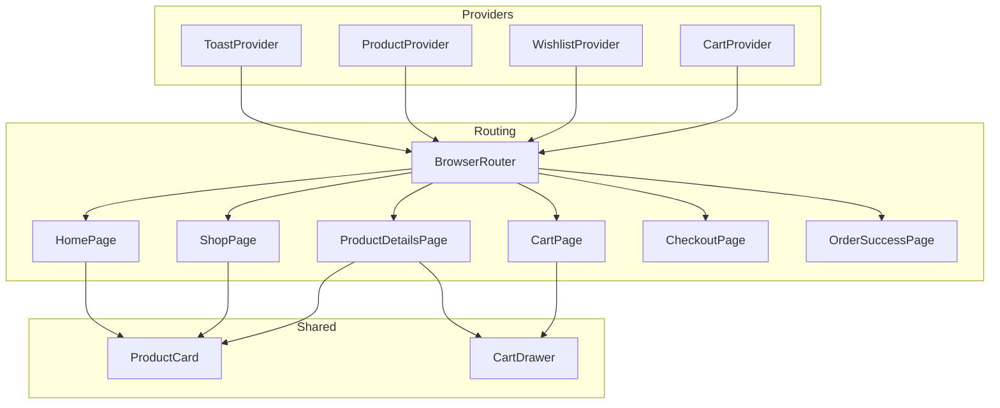
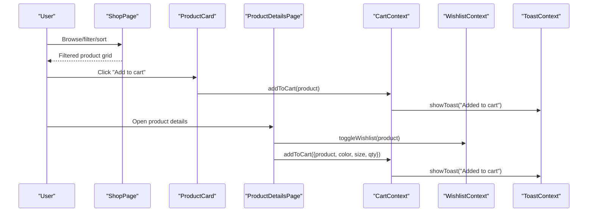
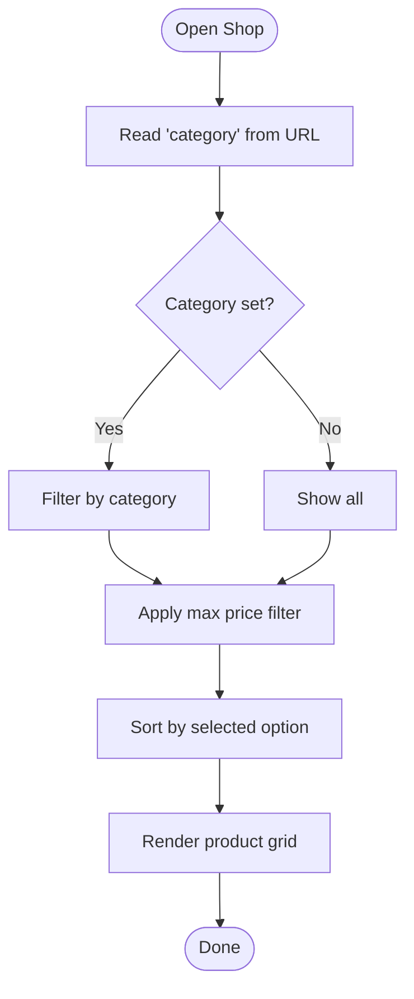
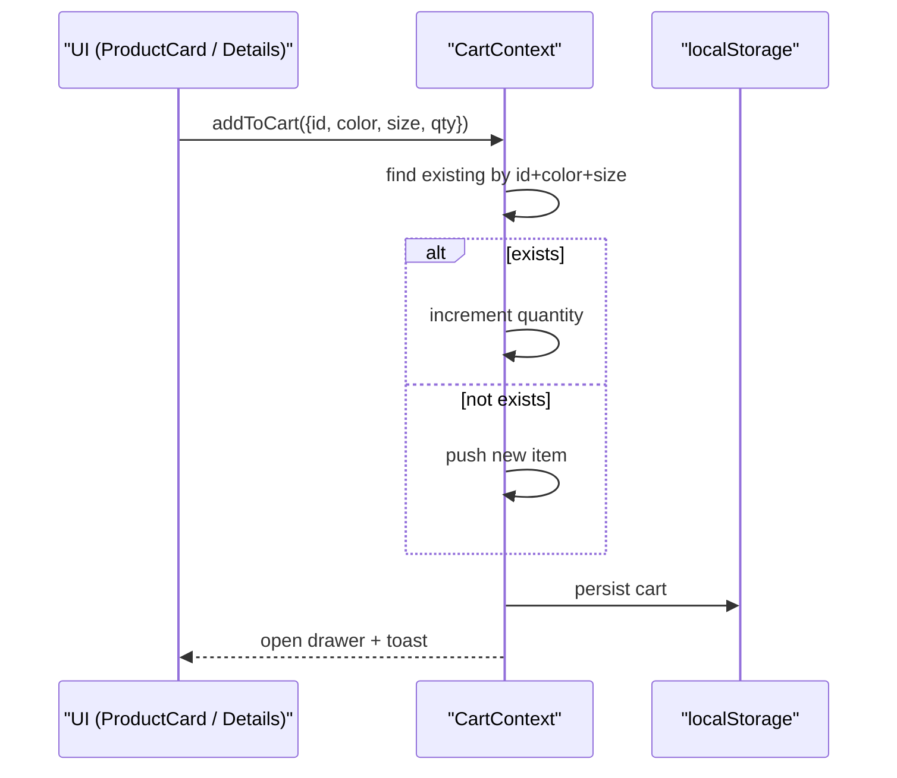
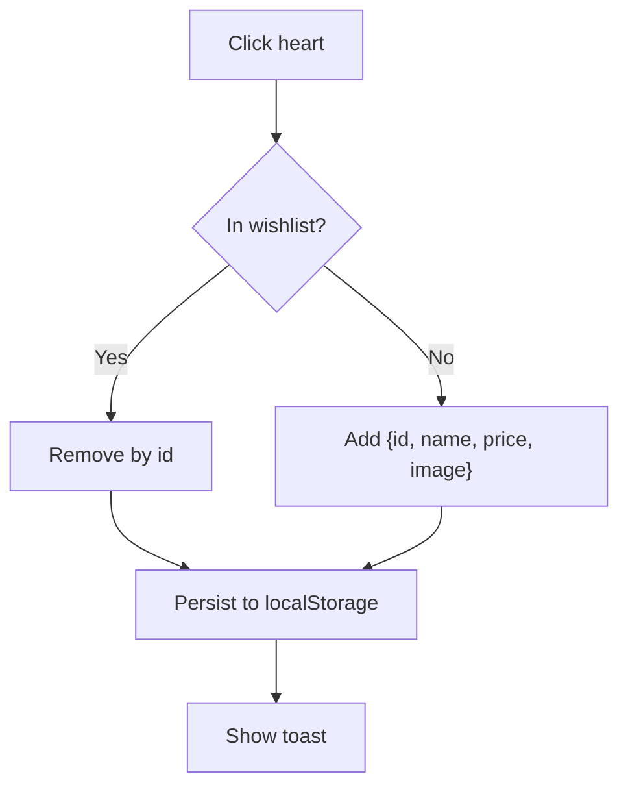
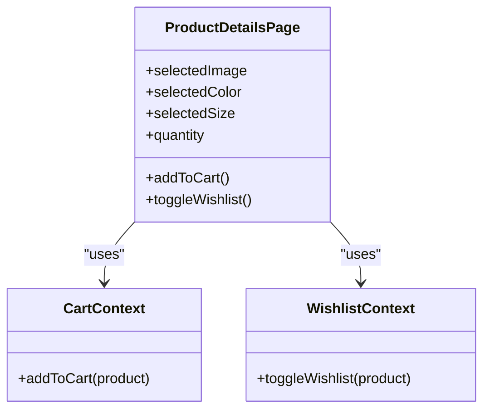
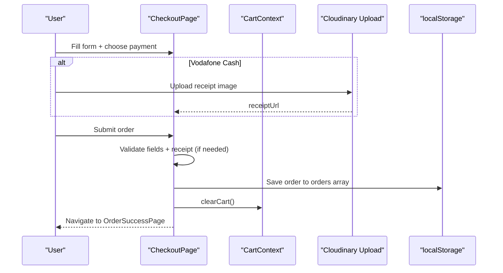
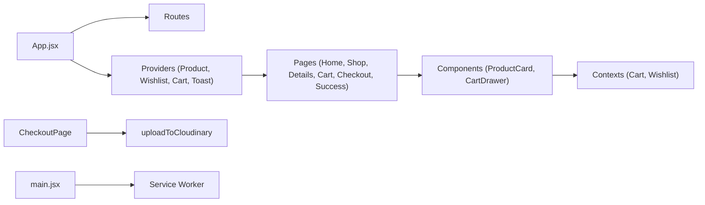

# Core Features

<cite>
**Referenced Files in This Document**
- [App.jsx](file://src/App.jsx)
- [main.jsx](file://src/main.jsx)
- [products.js](file://src/data/products.js)
- [ProductContext.jsx](file://src/context/ProductContext.jsx)
- [CartContext.jsx](file://src/context/CartContext.jsx)
- [WishlistContext.jsx](file://src/context/WishlistContext.jsx)
- [ToastContext.jsx](file://src/context/ToastContext.jsx)
- [HomePage.jsx](file://src/pages/HomePage.jsx)
- [ShopPage.jsx](file://src/pages/ShopPage.jsx)
- [ProductDetailsPage.jsx](file://src/pages/ProductDetailsPage.jsx)
- [CartPage.jsx](file://src/pages/CartPage.jsx)
- [CheckoutPage.jsx](file://src/pages/CheckoutPage.jsx)
- [OrderSuccessPage.jsx](file://src/pages/OrderSuccessPage.jsx)
- [ProductCard.jsx](file://src/components/ProductCard.jsx)
- [CartDrawer.jsx](file://src/components/CartDrawer.jsx)
- [package.json](file://package.json)
</cite>

## Table of Contents
1. Introduction
2. Project Structure
3. Core Components
4. Architecture Overview
5. Detailed Component Analysis
6. Dependency Analysis
7. Performance Considerations
8. Troubleshooting Guide
9. Conclusion

## Introduction
This document explains the core e-commerce features of the Hadiya Abaya Store, including product catalog browsing with category filtering and search, shopping cart management with quantity controls and persistence, wishlist functionality, detailed product views with size and color options, and a checkout flow ending in order confirmation. It also describes how UI components integrate with React Context state providers, outlines user workflows from discovery to purchase completion, and highlights mobile-specific optimizations and responsive design considerations.

## Project Structure
The application is a React SPA built with Vite and React Router. The root App component wraps the app with global providers (toast, products, wishlist, cart) and defines routes for home, shop, product details, cart, checkout, order success, and admin. Pages render feature-specific UIs, while shared components like ProductCard and CartDrawer are reused across pages. Data is sourced from a local product dataset and persisted via localStorage for cart, wishlist, and products. A Service Worker is registered in production for caching and offline support.

**Diagram sources**
- [App.jsx:95-109](file://src/App.jsx#L95-L109)
- [App.jsx:66-74](file://src/App.jsx#L66-L74)
- [ProductCard.jsx:1-74](file://src/components/ProductCard.jsx#L1-L74)
- [CartDrawer.jsx:1-72](file://src/components/CartDrawer.jsx#L1-L72)

**Section sources**
- [App.jsx:1-109](file://src/App.jsx#L1-L109)
- [main.jsx:1-21](file://src/main.jsx#L1-L21)
- [package.json:1-21](file://package.json#L1-L21)

## Core Components
- Product data model: Each product includes id, name, category/categoryName, price/oldPrice, badge/badgeText, image, description, stock, colors, sizes.
- State providers:
  - ProductContext: manages product list and CRUD operations; persists to localStorage.
  - CartContext: manages cart items, quantities, totals, open/close drawer; persists to localStorage.
  - WishlistContext: toggles favorites, persists to localStorage.
  - ToastContext: displays transient notifications.
- Shared UI:
  - ProductCard: shows product info, quick add to cart, wishlist toggle, and link to details.
  - CartDrawer: slide-out cart preview with quantity controls and checkout link.

Key responsibilities:
- Browsing and filtering: ShopPage filters by category and price, sorts by price or featured.
- Detail view: ProductDetailsPage handles color/size selection, quantity, add-to-cart, and wishlist toggle.
- Cart: CartPage and CartDrawer manage item lists, quantity updates, removal, totals, and checkout navigation.
- Checkout: CheckoutPage validates form, supports payment methods (Vodafone Cash with receipt upload to Cloudinary or COD), saves orders to localStorage, clears cart, and navigates to OrderSuccessPage.
- Success: OrderSuccessPage shows order summary and provides a WhatsApp share link.

**Section sources**
- [products.js:1-93](file://src/data/products.js#L1-L93)
- [ProductContext.jsx:1-56](file://src/context/ProductContext.jsx#L1-L56)
- [CartContext.jsx:1-132](file://src/context/CartContext.jsx#L1-L132)
- [WishlistContext.jsx:1-68](file://src/context/WishlistContext.jsx#L1-L68)
- [ToastContext.jsx:1-26](file://src/context/ToastContext.jsx#L1-L26)
- [ProductCard.jsx:1-74](file://src/components/ProductCard.jsx#L1-L74)
- [CartDrawer.jsx:1-72](file://src/components/CartDrawer.jsx#L1-L72)

## Architecture Overview
The app uses a provider-based architecture to centralize state and side effects. Routes map to page components that consume contexts to read/write state. Shared components interact with contexts to trigger actions (add to cart, toggle wishlist). Checkout integrates with an external upload utility for receipts and persists orders locally.

**Diagram sources**
- [ShopPage.jsx:1-195](file://src/pages/ShopPage.jsx#L1-L195)
- [ProductCard.jsx:1-74](file://src/components/ProductCard.jsx#L1-L74)
- [ProductDetailsPage.jsx:1-176](file://src/pages/ProductDetailsPage.jsx#L1-L176)
- [CartContext.jsx:1-132](file://src/context/CartContext.jsx#L1-L132)
- [WishlistContext.jsx:1-68](file://src/context/WishlistContext.jsx#L1-L68)
- [ToastContext.jsx:1-26](file://src/context/ToastContext.jsx#L1-L26)

## Detailed Component Analysis

### Product Catalog Browsing (Home and Shop)
- Home page showcases hero slider, categories, and featured products. Category links navigate to ShopPage with query parameters for instant filtering.
- ShopPage implements:
  - Category filtering via URL query parameter and checkbox selection.
  - Price range filter using a slider.
  - Sorting by price ascending/descending or default “featured.”
  - Responsive sidebar toggle on mobile.
  - Empty state handling when no products match filters.

**Diagram sources**
- [ShopPage.jsx:6-45](file://src/pages/ShopPage.jsx#L6-L45)
- [ShopPage.jsx:17-32](file://src/pages/ShopPage.jsx#L17-L32)
- [ShopPage.jsx:175-188](file://src/pages/ShopPage.jsx#L175-L188)

**Section sources**
- [HomePage.jsx:1-263](file://src/pages/HomePage.jsx#L1-L263)
- [ShopPage.jsx:1-195](file://src/pages/ShopPage.jsx#L1-L195)

### Shopping Cart Management
- Add to cart:
  - From ProductCard quick-add or ProductDetailsPage with selected color, size, and quantity.
  - CartContext merges duplicates by matching id + color + size and increments quantity.
  - Opens CartDrawer and shows toast notification.
- Quantity controls:
  - Increment/decrement in both CartDrawer and CartPage.
  - Negative results remove the item automatically.
- Persistence:
  - Cart saved to localStorage under a dedicated key and restored on reload.
- Totals:
  - Computed counts and prices provided by context helpers.

**Diagram sources**
- [CartContext.jsx:42-74](file://src/context/CartContext.jsx#L42-L74)
- [CartContext.jsx:85-97](file://src/context/CartContext.jsx#L85-L97)
- [CartContext.jsx:7-40](file://src/context/CartContext.jsx#L7-L40)

**Section sources**
- [CartContext.jsx:1-132](file://src/context/CartContext.jsx#L1-L132)
- [ProductCard.jsx:1-74](file://src/components/ProductCard.jsx#L1-L74)
- [ProductDetailsPage.jsx:156-163](file://src/pages/ProductDetailsPage.jsx#L156-L163)
- [CartDrawer.jsx:1-72](file://src/components/CartDrawer.jsx#L1-L72)
- [CartPage.jsx:1-120](file://src/pages/CartPage.jsx#L1-L120)

### Wishlist System
- Toggle favorite:
  - ProductCard and ProductDetailsPage call toggleWishlist.
  - Adds/removes item based on id; persists to localStorage.
- Visual feedback:
  - Heart icon reflects wishlisted state.
  - Toast messages confirm actions.

**Diagram sources**
- [WishlistContext.jsx:22-48](file://src/context/WishlistContext.jsx#L22-L48)
- [WishlistContext.jsx:6-20](file://src/context/WishlistContext.jsx#L6-L20)

**Section sources**
- [WishlistContext.jsx:1-68](file://src/context/WishlistContext.jsx#L1-L68)
- [ProductCard.jsx:31-42](file://src/components/ProductCard.jsx#L31-L42)
- [ProductDetailsPage.jsx:52-60](file://src/pages/ProductDetailsPage.jsx#L52-L60)

### Detailed Product Views (Size and Color Options)
- Displays product image gallery, title, pricing (including discount percentage), description.
- Color swatches mapped to hex values; size buttons selectable.
- Quantity selector with min 1.
- Add to cart passes selected color, size, and quantity into context.
- Wishlist toggle integrated.

**Diagram sources**
- [ProductDetailsPage.jsx:7-23](file://src/pages/ProductDetailsPage.jsx#L7-L23)
- [ProductDetailsPage.jsx:102-168](file://src/pages/ProductDetailsPage.jsx#L102-L168)
- [CartContext.jsx:42-74](file://src/context/CartContext.jsx#L42-L74)
- [WishlistContext.jsx:22-39](file://src/context/WishlistContext.jsx#L22-L39)

**Section sources**
- [ProductDetailsPage.jsx:1-176](file://src/pages/ProductDetailsPage.jsx#L1-L176)

### Checkout Process and Order Confirmation
- Validation:
  - Required fields: full name, phone, address.
  - For Vodafone Cash: requires uploaded receipt image.
- Payment methods:
  - Vodafone Cash: copy number to clipboard, show steps, upload receipt to Cloudinary, validate presence.
  - Cash on Delivery: no receipt required.
- Order creation:
  - Generates unique orderId, builds order object with customer info, payment method, cart items, total amount, receipt preview, and date.
  - Saves to localStorage array of orders.
  - Clears cart and navigates to OrderSuccessPage with orderData.
- Success page:
  - Shows order summary and receipt preview if present.
  - Provides WhatsApp link pre-filled with order details.

**Diagram sources**
- [CheckoutPage.jsx:90-133](file://src/pages/CheckoutPage.jsx#L90-L133)
- [CheckoutPage.jsx:63-88](file://src/pages/CheckoutPage.jsx#L63-L88)
- [CartContext.jsx:99-101](file://src/context/CartContext.jsx#L99-L101)
- [OrderSuccessPage.jsx:1-103](file://src/pages/OrderSuccessPage.jsx#L1-L103)

**Section sources**
- [CheckoutPage.jsx:1-489](file://src/pages/CheckoutPage.jsx#L1-L489)
- [OrderSuccessPage.jsx:1-103](file://src/pages/OrderSuccessPage.jsx#L1-L103)

### Mobile-Specific Optimizations and Responsive Design
- Mobile bottom navigation and mobile menu drawer for easy access to search and navigation.
- ShopPage sidebar collapses into a toggleable panel on small screens.
- CartDrawer provides a slide-out cart experience optimized for touch interactions.
- Images use lazy loading where appropriate; main product image loads eagerly for performance.
- Service Worker registration in production enables caching and offline resilience.

**Section sources**
- [App.jsx:12-18](file://src/App.jsx#L12-L18)
- [App.jsx:76-82](file://src/App.jsx#L76-L82)
- [ShopPage.jsx:78-101](file://src/pages/ShopPage.jsx#L78-L101)
- [CartDrawer.jsx:1-72](file://src/components/CartDrawer.jsx#L1-L72)
- [ProductDetailsPage.jsx:51-71](file://src/pages/ProductDetailsPage.jsx#L51-L71)
- [main.jsx:11-20](file://src/main.jsx#L11-L20)

## Dependency Analysis
- Routing and layout:
  - App.jsx sets up BrowserRouter and route definitions, wrapping content with providers.
- Context dependencies:
  - ProductContext depends on initialProducts data source.
  - CartContext and WishlistContext depend on ToastContext for user feedback.
  - Pages consume multiple contexts to coordinate UI and state.
- External integrations:
  - Cloudinary used for uploading receipt images during checkout.
  - Service Worker registered in production for caching.

**Diagram sources**
- [App.jsx:95-109](file://src/App.jsx#L95-L109)
- [ProductContext.jsx:1-56](file://src/context/ProductContext.jsx#L1-L56)
- [CartContext.jsx:1-132](file://src/context/CartContext.jsx#L1-L132)
- [WishlistContext.jsx:1-68](file://src/context/WishlistContext.jsx#L1-L68)
- [CheckoutPage.jsx:1-489](file://src/pages/CheckoutPage.jsx#L1-L489)
- [main.jsx:11-20](file://src/main.jsx#L11-L20)

**Section sources**
- [App.jsx:1-109](file://src/App.jsx#L1-L109)
- [main.jsx:1-21](file://src/main.jsx#L1-L21)
- [package.json:1-21](file://package.json#L1-L21)

## Performance Considerations
- Client-side filtering and sorting reduce server load and improve responsiveness.
- LocalStorage persistence avoids re-fetching data and maintains state across sessions.
- Lazy loading of non-critical images improves initial paint time.
- Service Worker caching reduces network requests in production.
- Avoid unnecessary re-renders by keeping context state minimal and derived computations efficient.

[No sources needed since this section provides general guidance]

## Troubleshooting Guide
- Cart not persisting:
  - Ensure localStorage is enabled and not blocked by browser settings.
  - Verify CartContext writes to storage on changes and reads on initialization.
- Wishlist not updating:
  - Confirm toggleWishlist is called and localStorage key is consistent.
- Checkout validation errors:
  - Required fields must be filled; for Vodafone Cash, ensure receipt image is uploaded before submission.
  - If upload fails, retry or check network permissions and Cloudinary configuration.
- Toast not showing:
  - Verify ToastProvider wraps the app and showToast is invoked after actions.
- Mobile UI issues:
  - Check responsive classes and ensure drawer states are toggled correctly.

**Section sources**
- [CartContext.jsx:7-40](file://src/context/CartContext.jsx#L7-L40)
- [WishlistContext.jsx:6-20](file://src/context/WishlistContext.jsx#L6-L20)
- [CheckoutPage.jsx:90-133](file://src/pages/CheckoutPage.jsx#L90-L133)
- [ToastContext.jsx:5-23](file://src/context/ToastContext.jsx#L5-L23)

## Conclusion
The Hadiya Abaya Store delivers a complete e-commerce experience through well-structured React components and centralized state management. Users can browse and filter products, manage their cart and wishlist, select product variants, and complete checkout with flexible payment options. The app emphasizes mobile usability, responsive layouts, and client-side persistence for a smooth shopping journey. Future enhancements could include server-side order processing, richer analytics, and expanded payment integrations.