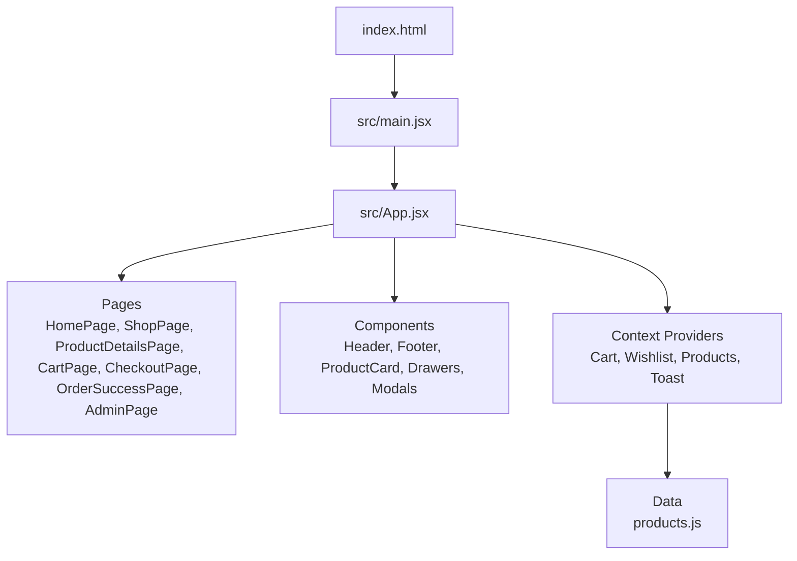
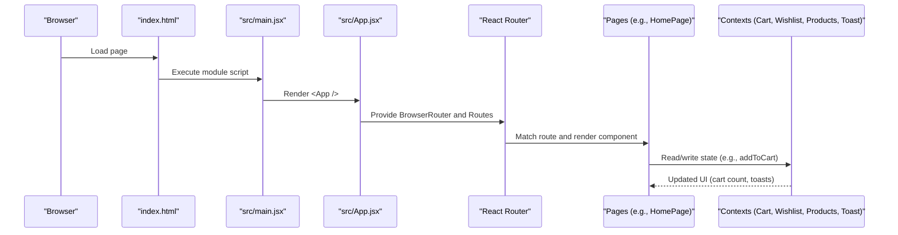
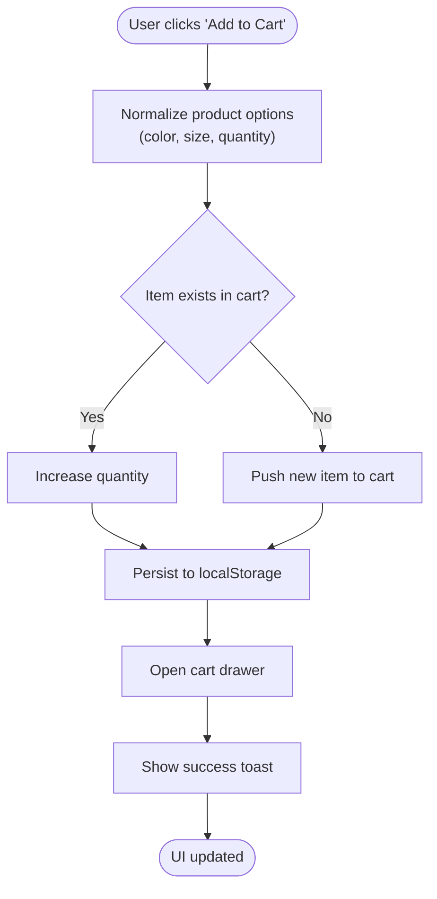
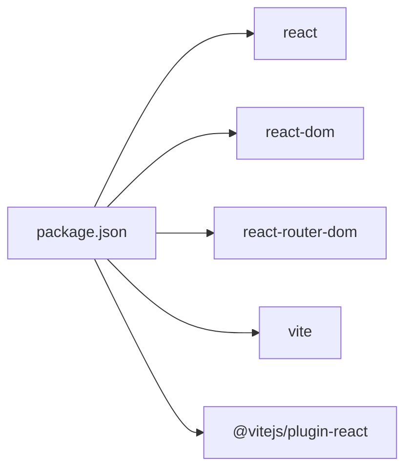

# Getting Started

<cite>
**Referenced Files in This Document**
- [package.json](file://package.json)
- [vite.config.js](file://vite.config.js)
- [index.html](file://index.html)
- [src/main.jsx](file://src/main.jsx)
- [src/App.jsx](file://src/App.jsx)
- [src/data/products.js](file://src/data/products.js)
- [src/context/CartContext.jsx](file://src/context/CartContext.jsx)
- [src/pages/HomePage.jsx](file://src/pages/HomePage.jsx)
- [src/components/ProductCard.jsx](file://src/components/ProductCard.jsx)
</cite>

## Table of Contents
1. Introduction
2. Project Structure
3. Core Components
4. Architecture Overview
5. Detailed Component Analysis
6. Dependency Analysis
7. Performance Considerations
8. Troubleshooting Guide
9. Conclusion

## Introduction
This guide helps you set up and run the Hadiya Abaya Store locally, understand its structure, and use key features such as browsing products, adding items to the cart, and navigating pages. The project is a React application built with Vite and uses React Router for navigation. It includes context providers for cart, wishlist, products, and toast notifications, and it supports a service worker for offline caching in production.

## Project Structure
The repository is organized around a modern React + Vite setup:
- Root configuration files define scripts, dependencies, and build settings.
- The src directory contains the application code:
  - components: Reusable UI elements (Header, Footer, ProductCard, drawers, modals).
  - context: Global state via React Context (Cart, Wishlist, Products, Toast).
  - data: Sample product catalog used by the app.
  - pages: Route-based screens (Home, Shop, Product Details, Cart, Checkout, Order Success, Admin).
  - styles: CSS files for layout and animations.
  - utils: Helper modules (e.g., cloudinary integration).
- Static assets are under images and public folders.

**Diagram sources**
- [index.html:1-19](file://index.html#L1-L19)
- [src/main.jsx:1-21](file://src/main.jsx#L1-L21)
- [src/App.jsx:1-110](file://src/App.jsx#L1-L110)
- [src/data/products.js:1-93](file://src/data/products.js#L1-L93)

**Section sources**
- [package.json:1-21](file://package.json#L1-L21)
- [vite.config.js:1-12](file://vite.config.js#L1-L12)
- [index.html:1-19](file://index.html#L1-L19)

## Core Components
Key building blocks that power the store experience:
- Routing and Layout: App wraps the app with providers and defines routes for Home, Shop, Product Details, Cart, Checkout, Order Success, and Admin.
- Context Providers: Centralized state for cart, wishlist, products, and toast messages.
- Data Layer: A sample product catalog drives the UI and interactions.
- UI Components: Product cards, drawers, modals, header/footer, and mobile navigation.

How they work together:
- The root entry renders the app inside a strict mode wrapper and registers a service worker in production.
- App sets up routing and global providers, then composes pages and shared UI.
- Pages consume contexts to display dynamic content and handle user actions like adding to cart or toggling wishlist.

**Section sources**
- [src/main.jsx:1-21](file://src/main.jsx#L1-L21)
- [src/App.jsx:1-110](file://src/App.jsx#L1-L110)
- [src/context/CartContext.jsx:1-132](file://src/context/CartContext.jsx#L1-L132)
- [src/data/products.js:1-93](file://src/data/products.js#L1-L93)

## Architecture Overview
High-level flow from bootstrapping to rendering pages and handling interactions:

**Diagram sources**
- [index.html:14-17](file://index.html#L14-L17)
- [src/main.jsx:5-20](file://src/main.jsx#L5-L20)
- [src/App.jsx:95-109](file://src/App.jsx#L95-L109)
- [src/pages/HomePage.jsx:1-263](file://src/pages/HomePage.jsx#L1-L263)
- [src/context/CartContext.jsx:1-132](file://src/context/CartContext.jsx#L1-L132)

## Detailed Component Analysis

### Installation and Environment Setup
- Prerequisites
  - Node.js and npm installed on your system.
- Clone and install
  - Clone the repository to your machine.
  - Open a terminal in the project root and run:
    - npm install
- Start development server
  - Run: npm run dev
  - The Vite dev server starts on port 3000 and opens the browser automatically.
- Build for production
  - Run: npm run build
  - Preview the optimized build locally with: npm run preview

Notes:
- Scripts and dependencies are defined in the package file.
- Vite configuration enables the React plugin and configures the dev server to open the browser and listen on port 3000.

**Section sources**
- [package.json:1-21](file://package.json#L1-L21)
- [vite.config.js:1-12](file://vite.config.js#L1-L12)

### Development Workflow
- Local development
  - After starting the dev server, edit files under src; changes hot-reload instantly.
- Routing
  - The app uses React Router with routes for Home (/), Shop (/shop), Product Details (/product/:id), Cart (/cart), Checkout (/checkout), Order Success (/order-success), and Admin (/admin).
- Service Worker
  - In production builds, a service worker is registered to enable caching and offline capabilities.

**Section sources**
- [src/App.jsx:66-82](file://src/App.jsx#L66-L82)
- [src/main.jsx:11-20](file://src/main.jsx#L11-L20)

### Using the Application
- Browse the home page
  - Visit the root URL to see the hero slider, categories, and featured products.
- Navigate to shop
  - Click category links or the shop button to go to /shop.
- View product details
  - Click a product card to open /product/:id for detailed information.
- Add products to cart
  - Use the quick add button on a product card to add an item to the cart. The cart drawer opens and shows a success notification.
- Manage cart
  - Open the cart drawer or navigate to /cart to review items, adjust quantities, remove items, and proceed to checkout.
- Wishlist
  - Toggle the heart icon on a product card to add/remove items from the wishlist.
- Admin area
  - Access /admin for administrative features.

**Section sources**
- [src/pages/HomePage.jsx:1-263](file://src/pages/HomePage.jsx#L1-L263)
- [src/components/ProductCard.jsx:1-74](file://src/components/ProductCard.jsx#L1-L74)
- [src/context/CartContext.jsx:42-74](file://src/context/CartContext.jsx#L42-L74)

### Data Model and State Flow
- Product catalog
  - A sample dataset provides product entries with id, name, category, price, images, and metadata.
- Cart state
  - The cart context manages items persisted in local storage, supports adding, removing, updating quantities, clearing, and computing totals.
- Interaction example
  - When a user clicks “Add to Cart” on a product card, the cart context updates the cart array, persists changes, opens the cart drawer, and shows a toast message.

**Diagram sources**
- [src/components/ProductCard.jsx:52-56](file://src/components/ProductCard.jsx#L52-L56)
- [src/context/CartContext.jsx:42-74](file://src/context/CartContext.jsx#L42-L74)
- [src/context/CartContext.jsx:38-40](file://src/context/CartContext.jsx#L38-L40)

**Section sources**
- [src/data/products.js:1-93](file://src/data/products.js#L1-L93)
- [src/context/CartContext.jsx:1-132](file://src/context/CartContext.jsx#L1-L132)
- [src/components/ProductCard.jsx:1-74](file://src/components/ProductCard.jsx#L1-L74)

## Dependency Analysis
Core runtime and tooling dependencies:
- React and ReactDOM for UI rendering.
- React Router for client-side routing.
- Vite and the React plugin for fast development and optimized builds.

**Diagram sources**
- [package.json:11-19](file://package.json#L11-L19)

**Section sources**
- [package.json:1-21](file://package.json#L1-L21)

## Performance Considerations
- Fast refresh and HMR: Vite provides instant feedback during development.
- Optimized production build: Use npm run build to generate a minified, asset-optimized bundle.
- Offline support: A service worker is registered in production to cache assets and improve resilience.
- Image loading: Images use lazy loading attributes to reduce initial payload.

[No sources needed since this section provides general guidance]

## Troubleshooting Guide
Common issues and resolutions for first-time users:
- Port already in use
  - If port 3000 is occupied, change the dev server port in the Vite configuration and restart the server.
- Module resolution errors
  - Ensure Node.js version meets the requirements for the project’s dependencies and reinstall node_modules if necessary.
- Assets not loading
  - Verify that image paths match those under the images folder and that the build references them correctly.
- Service worker registration fails in production
  - Confirm the deployment serves the service worker at the expected path and that HTTPS is enabled where required.
- Routing not working as expected
  - Check that routes are defined in the main application file and that links use the correct paths.

**Section sources**
- [vite.config.js:7-10](file://vite.config.js#L7-L10)
- [src/main.jsx:11-20](file://src/main.jsx#L11-L20)
- [src/App.jsx:66-82](file://src/App.jsx#L66-L82)

## Conclusion
You now have everything needed to install, run, and use the Hadiya Abaya Store. Explore the home page, browse the shop, view product details, add items to the cart, and navigate through the available sections. For production, build the app and deploy the generated output. Refer to the troubleshooting section if you encounter common setup issues.