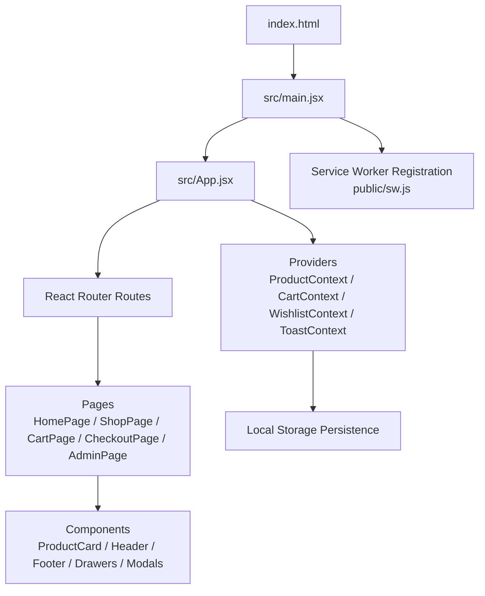
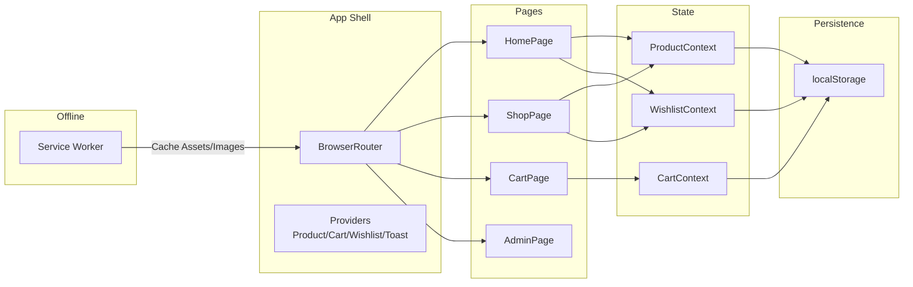
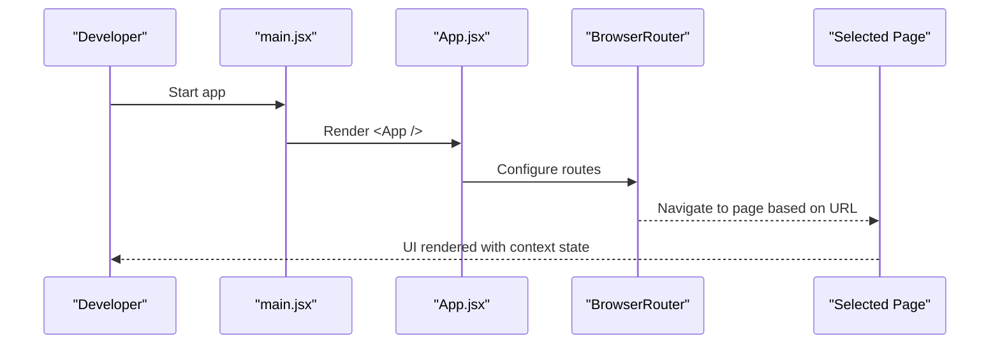
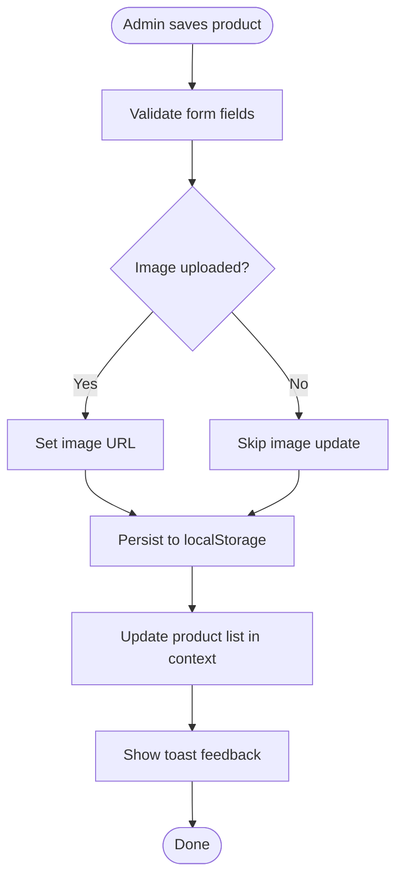
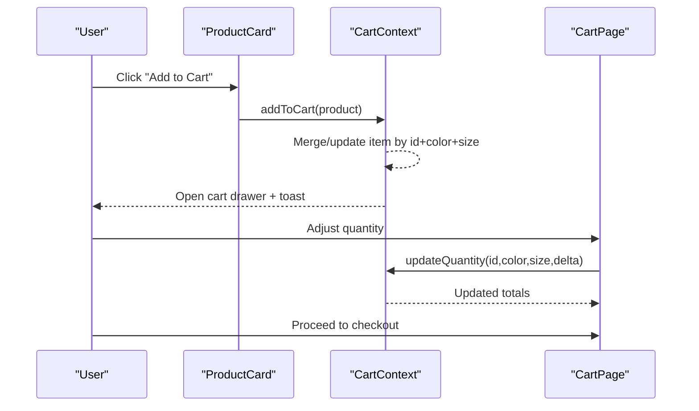
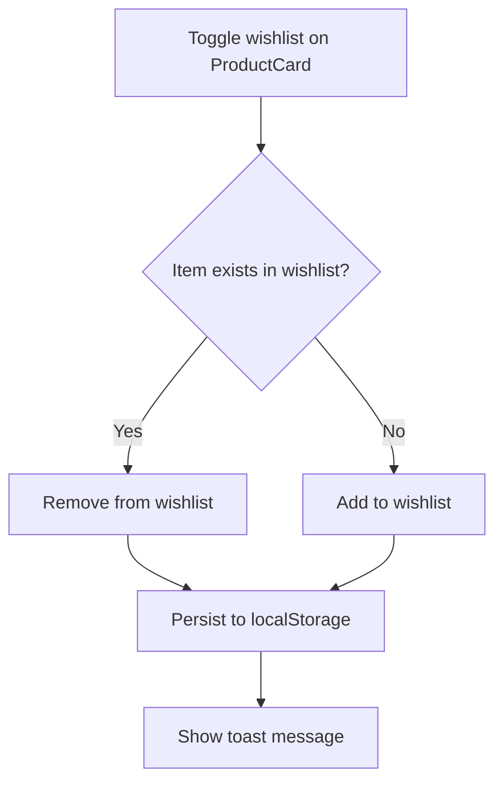
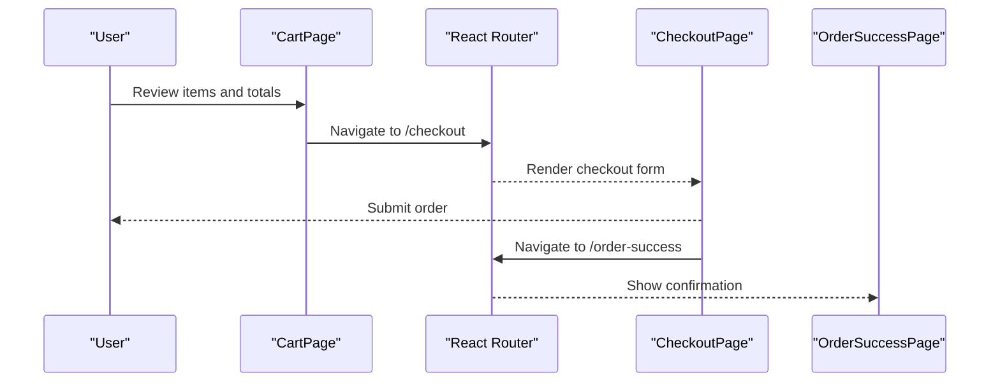
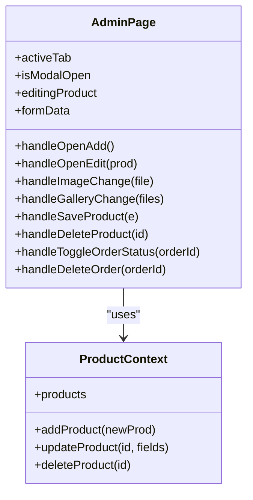
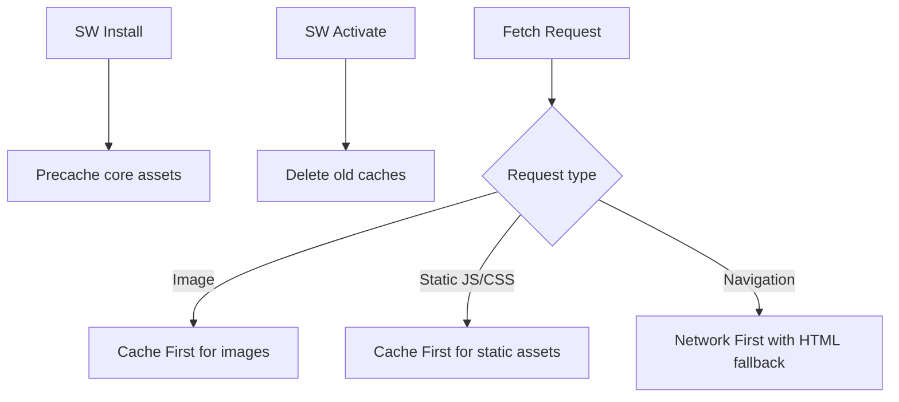
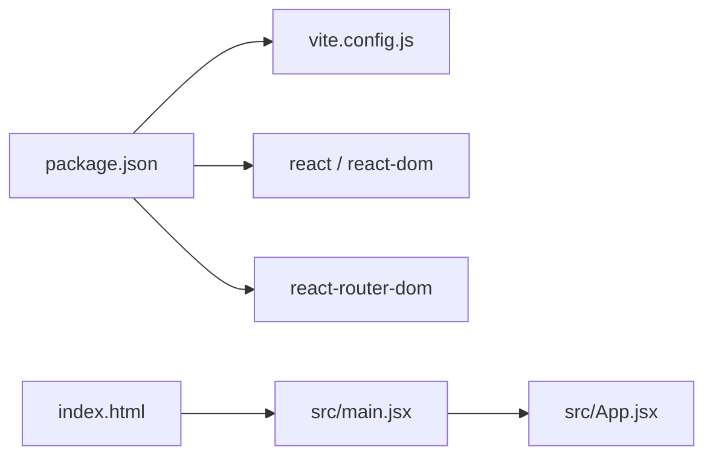

# Project Overview

<cite>
**Referenced Files in This Document**
- [package.json](file://package.json)
- [vite.config.js](file://vite.config.js)
- [index.html](file://index.html)
- [src/main.jsx](file://src/main.jsx)
- [src/App.jsx](file://src/App.jsx)
- [src/context/CartContext.jsx](file://src/context/CartContext.jsx)
- [src/context/ProductContext.jsx](file://src/context/ProductContext.jsx)
- [src/context/WishlistContext.jsx](file://src/context/WishlistContext.jsx)
- [src/data/products.js](file://src/data/products.js)
- [src/pages/HomePage.jsx](file://src/pages/HomePage.jsx)
- [src/pages/ShopPage.jsx](file://src/pages/ShopPage.jsx)
- [src/pages/CartPage.jsx](file://src/pages/CartPage.jsx)
- [src/pages/AdminPage.jsx](file://src/pages/AdminPage.jsx)
- [src/components/ProductCard.jsx](file://src/components/ProductCard.jsx)
- [public/sw.js](file://public/sw.js)
</cite>

## Table of Contents
1. Introduction
2. Project Structure
3. Core Components
4. Architecture Overview
5. Detailed Component Analysis
6. Dependency Analysis
7. Performance Considerations
8. Troubleshooting Guide
9. Conclusion

## Introduction
Hadiya Abaya Store is a modern e-commerce platform specializing in modest Islamic fashion, including abayas, niqabs, and khimars. It delivers a mobile-first shopping experience with product browsing, filtering, cart management, wishlist, checkout flow, and an admin dashboard for store operations. The application is built with React 18.3.1, Vite 5.4.21, and React Router DOM 6.30.4, using a component-based architecture and Context API for state management. Offline capabilities are enabled via Service Worker integration to cache assets and improve resilience.

## Project Structure
The project follows a feature-oriented layout:
- src/pages: Route-level pages (Home, Shop, Product Details, Cart, Checkout, Order Success, Admin)
- src/components: Reusable UI components (Header, Footer, Product Card, drawers, modals)
- src/context: Global state providers (Cart, Products, Wishlist, Toast)
- src/data: Initial product catalog data
- public: Static assets and Service Worker
- Root configuration files: package.json, vite.config.js, index.html

**Diagram sources**
- [index.html:1-19](file://index.html#L1-L19)
- [src/main.jsx:1-21](file://src/main.jsx#L1-L21)
- [src/App.jsx:1-110](file://src/App.jsx#L1-L110)
- [public/sw.js:1-98](file://public/sw.js#L1-L98)

**Section sources**
- [package.json:1-21](file://package.json#L1-L21)
- [vite.config.js:1-12](file://vite.config.js#L1-L12)
- [index.html:1-19](file://index.html#L1-L19)
- [src/main.jsx:1-21](file://src/main.jsx#L1-L21)
- [src/App.jsx:1-110](file://src/App.jsx#L1-L110)

## Core Components
- Application shell and routing: App sets up providers and routes for all pages, plus global UI elements like header, footer, drawers, and search modal.
- State management via Context API:
  - ProductContext manages the product catalog with add/update/delete and persistence to localStorage.
  - CartContext manages cart items, quantities, totals, and open/close drawer state with toast notifications.
  - WishlistContext toggles items in the wishlist and persists to localStorage.
- Pages:
  - HomePage: Hero slider, categories, featured products.
  - ShopPage: Category filters, price range, sorting, responsive sidebar.
  - CartPage: Item list, quantity controls, summary, and checkout navigation.
  - AdminPage: Dashboard stats, product CRUD, order management, settings.
- Shared components:
  - ProductCard: Displays product info, quick add to cart, and wishlist toggle.

Key features:
- Product catalog management with categories, badges, pricing, and stock.
- Shopping cart with persistent storage and quantity adjustments.
- Wishlist system with local persistence.
- Checkout process flow from cart to order success.
- Admin dashboard for managing products and orders.
- Offline support through Service Worker caching strategies.

**Section sources**
- [src/App.jsx:1-110](file://src/App.jsx#L1-L110)
- [src/context/ProductContext.jsx:1-56](file://src/context/ProductContext.jsx#L1-L56)
- [src/context/CartContext.jsx:1-132](file://src/context/CartContext.jsx#L1-L132)
- [src/context/WishlistContext.jsx:1-68](file://src/context/WishlistContext.jsx#L1-L68)
- [src/pages/HomePage.jsx:1-263](file://src/pages/HomePage.jsx#L1-L263)
- [src/pages/ShopPage.jsx:1-195](file://src/pages/ShopPage.jsx#L1-L195)
- [src/pages/CartPage.jsx:1-120](file://src/pages/CartPage.jsx#L1-L120)
- [src/pages/AdminPage.jsx:1-531](file://src/pages/AdminPage.jsx#L1-L531)
- [src/components/ProductCard.jsx:1-74](file://src/components/ProductCard.jsx#L1-L74)

## Architecture Overview
The app uses a provider-based architecture where global state is shared across components via React Context. Routing is handled by React Router, enabling SPA navigation between pages. Data flows from contexts into pages and components, while user actions update context state and persist to localStorage. Offline behavior is managed by a Service Worker that caches static assets and images.

**Diagram sources**
- [src/App.jsx:1-110](file://src/App.jsx#L1-L110)
- [src/context/ProductContext.jsx:1-56](file://src/context/ProductContext.jsx#L1-L56)
- [src/context/CartContext.jsx:1-132](file://src/context/CartContext.jsx#L1-L132)
- [src/context/WishlistContext.jsx:1-68](file://src/context/WishlistContext.jsx#L1-L68)
- [public/sw.js:1-98](file://public/sw.js#L1-L98)

## Detailed Component Analysis

### Provider and Routing Layer
- App wraps the application with providers to share state globally and configures routes for all pages. It also includes scroll-to-top behavior and conditional rendering for admin vs. customer views.

**Diagram sources**
- [src/main.jsx:1-21](file://src/main.jsx#L1-L21)
- [src/App.jsx:1-110](file://src/App.jsx#L1-L110)

**Section sources**
- [src/App.jsx:1-110](file://src/App.jsx#L1-L110)
- [src/main.jsx:1-21](file://src/main.jsx#L1-L21)

### Product Catalog Management
- ProductContext loads initial products from data and persists changes to localStorage. It exposes methods to add, update, and delete products. AdminPage uses these methods to manage inventory.

**Diagram sources**
- [src/context/ProductContext.jsx:1-56](file://src/context/ProductContext.jsx#L1-L56)
- [src/pages/AdminPage.jsx:1-531](file://src/pages/AdminPage.jsx#L1-L531)
- [src/data/products.js:1-93](file://src/data/products.js#L1-L93)

**Section sources**
- [src/context/ProductContext.jsx:1-56](file://src/context/ProductContext.jsx#L1-L56)
- [src/pages/AdminPage.jsx:1-531](file://src/pages/AdminPage.jsx#L1-L531)
- [src/data/products.js:1-93](file://src/data/products.js#L1-L93)

### Shopping Cart Flow
- Users can add products to the cart from ProductCard or other pages. CartContext handles item merging by id/color/size, updates quantities, calculates totals, and opens the cart drawer with toast feedback. CartPage allows editing quantities and navigating to checkout.

**Diagram sources**
- [src/components/ProductCard.jsx:1-74](file://src/components/ProductCard.jsx#L1-L74)
- [src/context/CartContext.jsx:1-132](file://src/context/CartContext.jsx#L1-L132)
- [src/pages/CartPage.jsx:1-120](file://src/pages/CartPage.jsx#L1-L120)

**Section sources**
- [src/components/ProductCard.jsx:1-74](file://src/components/ProductCard.jsx#L1-L74)
- [src/context/CartContext.jsx:1-132](file://src/context/CartContext.jsx#L1-L132)
- [src/pages/CartPage.jsx:1-120](file://src/pages/CartPage.jsx#L1-L120)

### Wishlist System
- Users can toggle items to/from their wishlist via ProductCard. WishlistContext persists selections to localStorage and provides helpers to check if an item is wishlisted.

**Diagram sources**
- [src/components/ProductCard.jsx:1-74](file://src/components/ProductCard.jsx#L1-L74)
- [src/context/WishlistContext.jsx:1-68](file://src/context/WishlistContext.jsx#L1-L68)

**Section sources**
- [src/components/ProductCard.jsx:1-74](file://src/components/ProductCard.jsx#L1-L74)
- [src/context/WishlistContext.jsx:1-68](file://src/context/WishlistContext.jsx#L1-L68)

### Checkout Process
- CartPage displays items and total, then navigates to the checkout route. The flow continues to order confirmation after successful submission.

**Diagram sources**
- [src/pages/CartPage.jsx:1-120](file://src/pages/CartPage.jsx#L1-L120)
- [src/App.jsx:1-110](file://src/App.jsx#L1-L110)

**Section sources**
- [src/pages/CartPage.jsx:1-120](file://src/pages/CartPage.jsx#L1-L120)
- [src/App.jsx:1-110](file://src/App.jsx#L1-L110)

### Admin Dashboard
- AdminPage provides tabs for dashboard overview, product management, order management, and settings. It supports adding/editing/deleting products and toggling order statuses. Image uploads integrate with Cloudinary utility.

**Diagram sources**
- [src/pages/AdminPage.jsx:1-531](file://src/pages/AdminPage.jsx#L1-L531)
- [src/context/ProductContext.jsx:1-56](file://src/context/ProductContext.jsx#L1-L56)

**Section sources**
- [src/pages/AdminPage.jsx:1-531](file://src/pages/AdminPage.jsx#L1-L531)
- [src/context/ProductContext.jsx:1-56](file://src/context/ProductContext.jsx#L1-L56)

### Offline Capabilities (Service Worker)
- The Service Worker implements caching strategies:
  - Precache essential assets during install.
  - Cache First for images and static assets (JS/CSS).
  - Network First for page navigation with HTML fallback.
- Registered in production via main.jsx to enable offline resilience.

**Diagram sources**
- [public/sw.js:1-98](file://public/sw.js#L1-L98)
- [src/main.jsx:1-21](file://src/main.jsx#L1-L21)

**Section sources**
- [public/sw.js:1-98](file://public/sw.js#L1-L98)
- [src/main.jsx:1-21](file://src/main.jsx#L1-L21)

## Dependency Analysis
- Runtime dependencies:
  - react and react-dom for UI framework.
  - react-router-dom for client-side routing.
- Build tooling:
  - vite and @vitejs/plugin-react for development and build pipeline.
- Configuration:
  - vite.config.js sets dev server port and enables React plugin.
  - index.html defines language/direction and loads the app entry.

**Diagram sources**
- [package.json:1-21](file://package.json#L1-L21)
- [vite.config.js:1-12](file://vite.config.js#L1-L12)
- [index.html:1-19](file://index.html#L1-L19)
- [src/main.jsx:1-21](file://src/main.jsx#L1-L21)
- [src/App.jsx:1-110](file://src/App.jsx#L1-L110)

**Section sources**
- [package.json:1-21](file://package.json#L1-L21)
- [vite.config.js:1-12](file://vite.config.js#L1-L12)
- [index.html:1-19](file://index.html#L1-L19)

## Performance Considerations
- Use lazy loading for images to reduce initial payload.
- Leverage Service Worker caching strategies to minimize network requests for static assets and images.
- Keep context state minimal and persisted only when necessary; avoid excessive re-renders by memoizing derived values.
- Optimize product lists with pagination or virtualization if the catalog grows significantly.
- Ensure efficient filtering/sorting on the client side for large datasets.

[No sources needed since this section provides general guidance]

## Troubleshooting Guide
- Service Worker registration fails:
  - Check browser support and ensure registration runs in production builds.
  - Verify sw.js path and correct MIME types for cached assets.
- LocalStorage issues:
  - Confirm keys used for persistence match across contexts (cart, products, wishlist).
  - Handle JSON parse errors gracefully when reading stored data.
- Routing problems:
  - Ensure BrowserRouter wraps the app and routes are correctly defined.
  - Validate that nested routes and query parameters are handled in pages.
- Context state mismatches:
  - Ensure actions update state immutably and trigger re-renders appropriately.
  - Use consistent identifiers (id, color, size) for cart item matching.

**Section sources**
- [src/main.jsx:11-21](file://src/main.jsx#L11-L21)
- [public/sw.js:1-98](file://public/sw.js#L1-L98)
- [src/context/CartContext.jsx:1-132](file://src/context/CartContext.jsx#L1-L132)
- [src/context/ProductContext.jsx:1-56](file://src/context/ProductContext.jsx#L1-L56)
- [src/context/WishlistContext.jsx:1-68](file://src/context/WishlistContext.jsx#L1-L68)
- [src/App.jsx:1-110](file://src/App.jsx#L1-L110)

## Conclusion
Hadiya Abaya Store delivers a robust, modern e-commerce experience tailored to modest Islamic fashion. With React 18.3.1, Vite 5.4.21, and React Router DOM 6.30.4, it offers a fast, responsive interface optimized for mobile devices. The Context API provides clean state management for cart, wishlist, and product catalog, while Service Worker integration ensures reliable offline access. The admin dashboard empowers store operators to manage products and orders efficiently. This architecture balances simplicity and scalability, making it suitable for growth and future enhancements.

[No sources needed since this section summarizes without analyzing specific files]