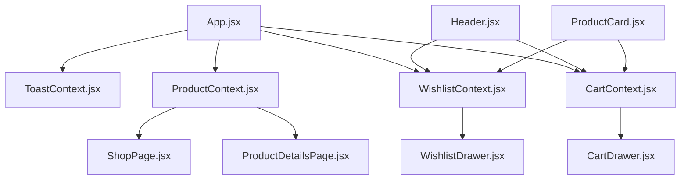
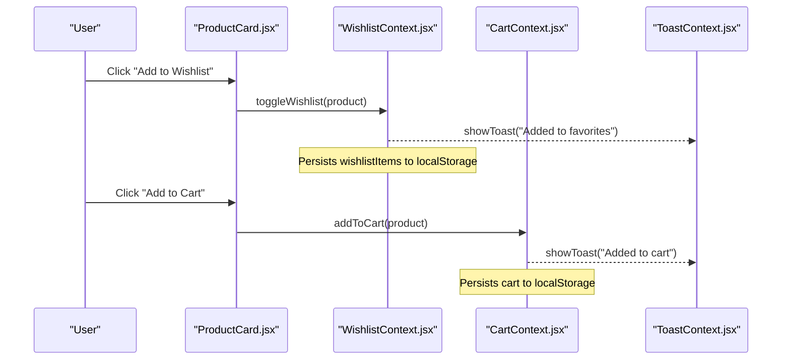
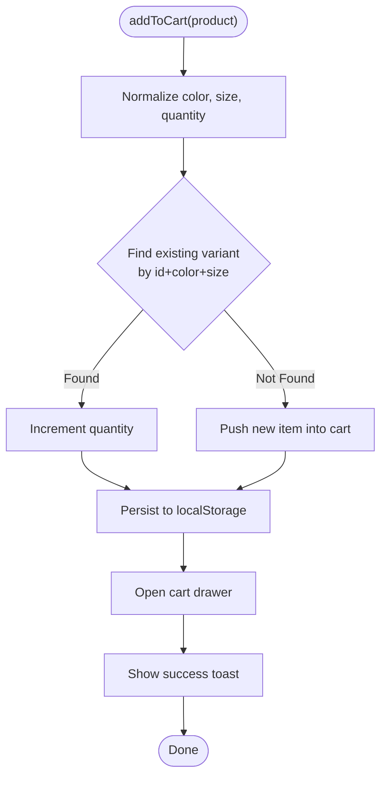
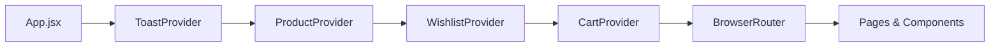
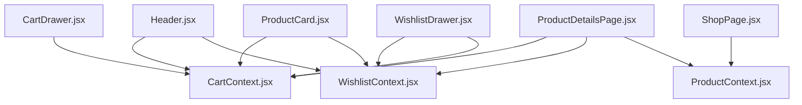

# State Management

<cite>
**Referenced Files in This Document**
- [App.jsx](file://src/App.jsx)
- [CartContext.jsx](file://src/context/CartContext.jsx)
- [WishlistContext.jsx](file://src/context/WishlistContext.jsx)
- [ProductContext.jsx](file://src/context/ProductContext.jsx)
- [ToastContext.jsx](file://src/context/ToastContext.jsx)
- [products.js](file://src/data/products.js)
- [Header.jsx](file://src/components/Header.jsx)
- [ProductCard.jsx](file://src/components/ProductCard.jsx)
- [CartDrawer.jsx](file://src/components/CartDrawer.jsx)
- [WishlistDrawer.jsx](file://src/components/WishlistDrawer.jsx)
- [ShopPage.jsx](file://src/pages/ShopPage.jsx)
- [ProductDetailsPage.jsx](file://src/pages/ProductDetailsPage.jsx)
</cite>

## Table of Contents
1. Introduction
2. Project Structure
3. Core Components
4. Architecture Overview
5. Detailed Component Analysis
6. Dependency Analysis
7. Performance Considerations
8. Troubleshooting Guide
9. Conclusion

## Introduction
This document explains the React Context API-based state management system used across the application to manage global state for cart, wishlist, product catalog, and toast notifications. It covers how contexts provide centralized data and actions, how components subscribe to updates, and how state is persisted to localStorage for cart, wishlist, and products. It also includes practical examples such as adding items to cart, managing favorites, filtering products, and displaying user notifications, along with performance tips, debugging techniques, and best practices.

## Project Structure
The application uses a layered structure:
- Contexts define global state and actions (cart, wishlist, products, toast).
- Providers wrap the app tree to expose context values.
- Pages and components consume contexts via custom hooks to read state and dispatch actions.
- Data sources include an initial product list and local storage for persistence.

**Diagram sources**
- [App.jsx:95-109](file://src/App.jsx#L95-L109)
- [CartContext.jsx:6-129](file://src/context/CartContext.jsx#L6-L129)
- [WishlistContext.jsx:6-65](file://src/context/WishlistContext.jsx#L6-L65)
- [ProductContext.jsx:6-53](file://src/context/ProductContext.jsx#L6-L53)
- [ToastContext.jsx:5-23](file://src/context/ToastContext.jsx#L5-L23)
- [CartDrawer.jsx:1-72](file://src/components/CartDrawer.jsx#L1-L72)
- [WishlistDrawer.jsx:1-66](file://src/components/WishlistDrawer.jsx#L1-L66)
- [Header.jsx:1-101](file://src/components/Header.jsx#L1-L101)
- [ProductCard.jsx:1-74](file://src/components/ProductCard.jsx#L1-L74)
- [ShopPage.jsx:1-195](file://src/pages/ShopPage.jsx#L1-L195)
- [ProductDetailsPage.jsx:1-179](file://src/pages/ProductDetailsPage.jsx#L1-L179)

**Section sources**
- [App.jsx:95-109](file://src/App.jsx#L95-L109)

## Core Components
- CartContext: Manages cart items, quantities, totals, open/close state, and persists to localStorage. Provides actions like add, remove, update quantity, clear, and getters for count/price.
- WishlistContext: Manages favorite items, toggling, removal, presence checks, and open/close state; persists to localStorage.
- ProductContext: Holds the product catalog, supports add/update/delete, and persists changes to localStorage. Initializes from a static dataset if no saved data exists.
- ToastContext: Centralized notification system that shows messages briefly and hides automatically.

These contexts are composed at the root of the app so any descendant component can access them without prop drilling.

**Section sources**
- [CartContext.jsx:6-132](file://src/context/CartContext.jsx#L6-L132)
- [WishlistContext.jsx:6-68](file://src/context/WishlistContext.jsx#L6-L68)
- [ProductContext.jsx:6-56](file://src/context/ProductContext.jsx#L6-L56)
- [ToastContext.jsx:5-26](file://src/context/ToastContext.jsx#L5-L26)

## Architecture Overview
The provider hierarchy wraps routing and UI, exposing shared state globally. Consumers subscribe to relevant contexts and trigger actions that mutate state and persist it.

**Diagram sources**
- [ProductCard.jsx:31-56](file://src/components/ProductCard.jsx#L31-L56)
- [WishlistContext.jsx:22-39](file://src/context/WishlistContext.jsx#L22-L39)
- [CartContext.jsx:42-74](file://src/context/CartContext.jsx#L42-L74)
- [ToastContext.jsx:8-13](file://src/context/ToastContext.jsx#L8-L13)

## Detailed Component Analysis

### CartContext
Responsibilities:
- Maintain cart array with id, name, price, image, color, size, quantity.
- Persist cart to localStorage under a dedicated key.
- Provide actions:
  - Add item: merges by id + color + size; increments quantity if same variant exists.
  - Remove item: filters by id and optional color/size.
  - Update quantity: adjusts up/down and removes item when quantity drops below 1.
  - Clear cart: resets to empty.
  - Getters: total count and total price.
- Manage drawer visibility and show toast notifications on mutations.

Data flow example: Adding an item

**Diagram sources**
- [CartContext.jsx:42-74](file://src/context/CartContext.jsx#L42-L74)
- [CartContext.jsx:38-40](file://src/context/CartContext.jsx#L38-L40)

Usage examples:
- Add to cart from ProductCard or ProductDetailsPage.
- Update quantity in CartDrawer.
- Display counts in Header.

**Section sources**
- [CartContext.jsx:6-132](file://src/context/CartContext.jsx#L6-L132)
- [ProductCard.jsx:31-56](file://src/components/ProductCard.jsx#L31-L56)
- [ProductDetailsPage.jsx:155-170](file://src/pages/ProductDetailsPage.jsx#L155-L170)
- [CartDrawer.jsx:41-49](file://src/components/CartDrawer.jsx#L41-L49)
- [Header.jsx:77-89](file://src/components/Header.jsx#L77-L89)

### WishlistContext
Responsibilities:
- Maintain wishlist array with minimal product info.
- Persist wishlist to localStorage.
- Actions:
  - Toggle: adds if not present, removes if present.
  - Remove: deletes by id.
  - Check presence: returns boolean for UI state.
- Manage drawer visibility and show toast notifications.

Usage examples:
- Toggle from ProductCard or ProductDetailsPage.
- Move item from wishlist to cart in WishlistDrawer.

**Section sources**
- [WishlistContext.jsx:6-68](file://src/context/WishlistContext.jsx#L6-L68)
- [ProductCard.jsx:31-42](file://src/components/ProductCard.jsx#L31-L42)
- [ProductDetailsPage.jsx:55-63](file://src/pages/ProductDetailsPage.jsx#L55-L63)
- [WishlistDrawer.jsx:39-55](file://src/components/WishlistDrawer.jsx#L39-L55)

### ProductContext
Responsibilities:
- Hold the product catalog and persist changes to localStorage.
- Initialize from a static dataset if no saved data exists.
- Actions:
  - Add product: creates a new entry with generated id and defaults.
  - Update product: merges fields by id.
  - Delete product: removes by id.

Usage examples:
- Read products in ShopPage to render grid.
- Admin operations would use add/update/delete (not shown here).

**Section sources**
- [ProductContext.jsx:6-56](file://src/context/ProductContext.jsx#L6-L56)
- [products.js:1-93](file://src/data/products.js#L1-L93)
- [ShopPage.jsx:6-8](file://src/pages/ShopPage.jsx#L6-L8)

### ToastContext
Responsibilities:
- Show a message with auto-hide after a short delay.
- Render a simple toast element within the provider.

Usage examples:
- Triggered by cart and wishlist actions to inform users.

**Section sources**
- [ToastContext.jsx:5-26](file://src/context/ToastContext.jsx#L5-L26)
- [CartContext.jsx:72-83](file://src/context/CartContext.jsx#L72-L83)
- [WishlistContext.jsx:22-44](file://src/context/WishlistContext.jsx#L22-L44)

### Provider Composition and Routing
Providers are nested at the app root to make contexts available throughout the app. Routing is wrapped inside providers so pages can consume contexts immediately.

**Diagram sources**
- [App.jsx:95-109](file://src/App.jsx#L95-L109)

**Section sources**
- [App.jsx:95-109](file://src/App.jsx#L95-L109)

## Dependency Analysis
- Components depend on contexts via custom hooks:
  - Header consumes cart count and wishlist items.
  - ProductCard triggers cart and wishlist actions.
  - CartDrawer reads cart state and invokes quantity updates.
  - WishlistDrawer reads wishlist state and invokes cart/wishlist actions.
  - ShopPage reads products and performs client-side filtering/sorting.
  - ProductDetailsPage reads products and triggers cart/wishlist actions.

**Diagram sources**
- [Header.jsx:1-101](file://src/components/Header.jsx#L1-L101)
- [ProductCard.jsx:1-74](file://src/components/ProductCard.jsx#L1-L74)
- [CartDrawer.jsx:1-72](file://src/components/CartDrawer.jsx#L1-L72)
- [WishlistDrawer.jsx:1-66](file://src/components/WishlistDrawer.jsx#L1-L66)
- [ShopPage.jsx:1-195](file://src/pages/ShopPage.jsx#L1-L195)
- [ProductDetailsPage.jsx:1-179](file://src/pages/ProductDetailsPage.jsx#L1-L179)
- [CartContext.jsx:6-132](file://src/context/CartContext.jsx#L6-L132)
- [WishlistContext.jsx:6-68](file://src/context/WishlistContext.jsx#L6-L68)
- [ProductContext.jsx:6-56](file://src/context/ProductContext.jsx#L6-L56)

**Section sources**
- [Header.jsx:1-101](file://src/components/Header.jsx#L1-L101)
- [ProductCard.jsx:1-74](file://src/components/ProductCard.jsx#L1-L74)
- [CartDrawer.jsx:1-72](file://src/components/CartDrawer.jsx#L1-L72)
- [WishlistDrawer.jsx:1-66](file://src/components/WishlistDrawer.jsx#L1-L66)
- [ShopPage.jsx:1-195](file://src/pages/ShopPage.jsx#L1-L195)
- [ProductDetailsPage.jsx:1-179](file://src/pages/ProductDetailsPage.jsx#L1-L179)

## Performance Considerations
- LocalStorage writes occur on every state change due to useEffect dependencies. For large datasets, consider debouncing or batching writes to reduce I/O overhead.
- Context re-renders: Any consumer subscribes to the entire context value. If a context grows large, consider splitting into smaller contexts or memoizing derived values to limit unnecessary re-renders.
- Filtering and sorting: ShopPage computes filtered and sorted lists on each render. For very large catalogs, consider memoization or virtualization strategies.
- Toast timing: Auto-hide duration is fixed; ensure it’s sufficient for user readability without blocking interactions.

[No sources needed since this section provides general guidance]

## Troubleshooting Guide
Common issues and resolutions:
- Cart or wishlist not persisting:
  - Verify localStorage keys are consistent and not blocked by browser settings.
  - Ensure JSON parsing does not throw on corrupted data; fallback to defaults is implemented.
- Duplicate cart entries:
  - Confirm that color and size are consistently provided when adding items. The cart merges by id + color + size.
- Wishlist toggle not reflecting:
  - Ensure the same product id is used across components; mismatched ids will prevent correct detection.
- Toast not showing:
  - Confirm ToastProvider wraps the component tree and that showToast is called from within a provider scope.

Debugging tips:
- Inspect localStorage keys for cart, wishlist, and products to verify persistence.
- Use React DevTools to inspect context values and trace re-renders.
- Temporarily log state transitions in context actions to validate expected behavior.

**Section sources**
- [CartContext.jsx:7-40](file://src/context/CartContext.jsx#L7-L40)
- [WishlistContext.jsx:7-20](file://src/context/WishlistContext.jsx#L7-L20)
- [ProductContext.jsx:7-18](file://src/context/ProductContext.jsx#L7-L18)
- [ToastContext.jsx:8-13](file://src/context/ToastContext.jsx#L8-L13)

## Conclusion
This Context-based architecture centralizes global state for cart, wishlist, products, and notifications, enabling scalable state management without prop drilling. Persistence to localStorage ensures user data survives page reloads. Consumers subscribe to relevant contexts and trigger actions that update state and notify users. By following best practices—splitting concerns across contexts, minimizing re-renders, and handling edge cases—you can maintain a performant and maintainable application.

[No sources needed since this section summarizes without analyzing specific files]